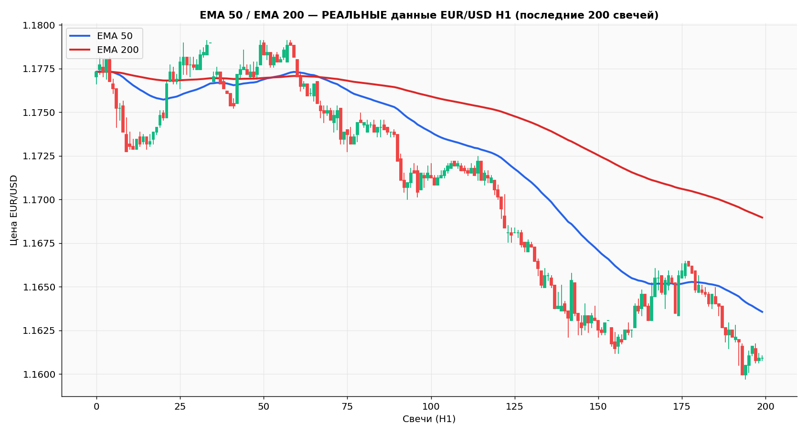
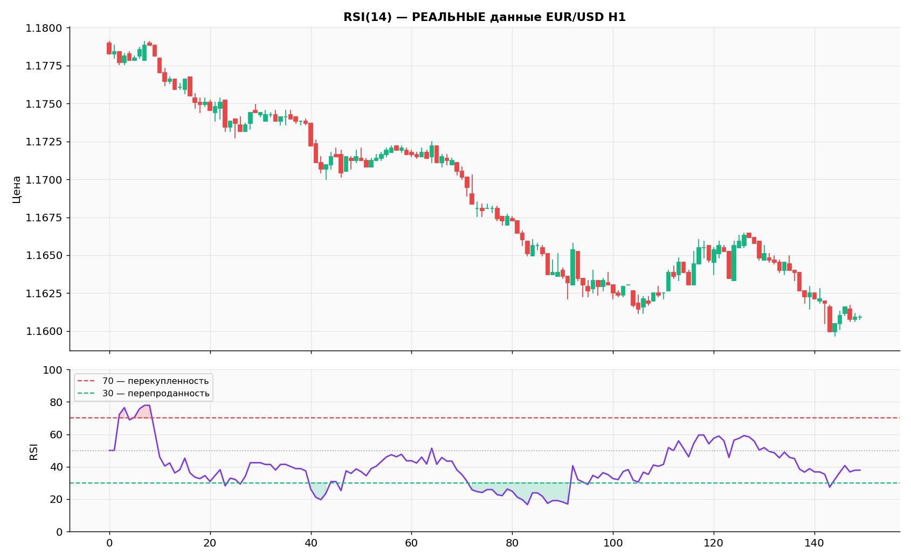
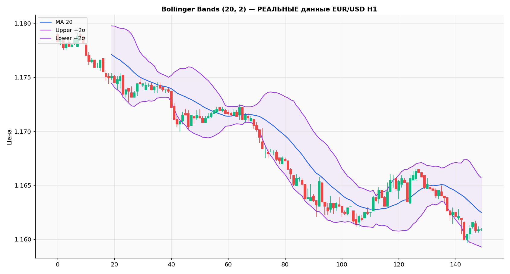
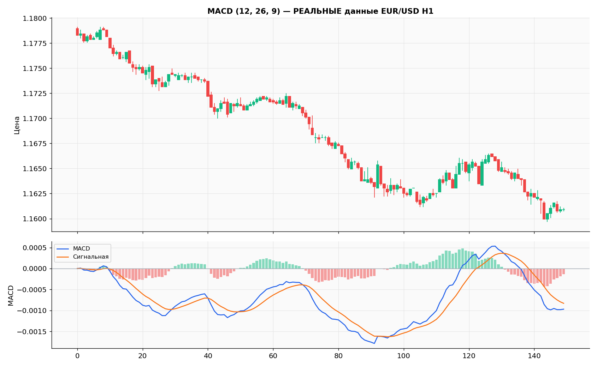
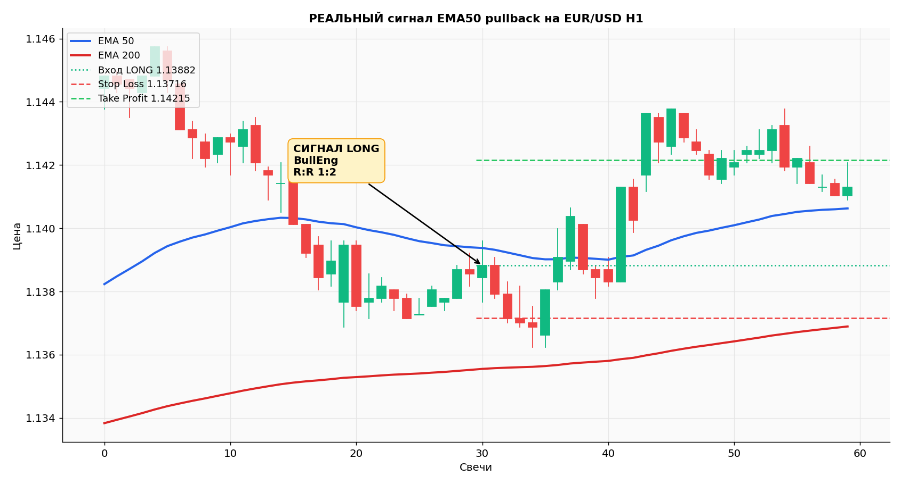
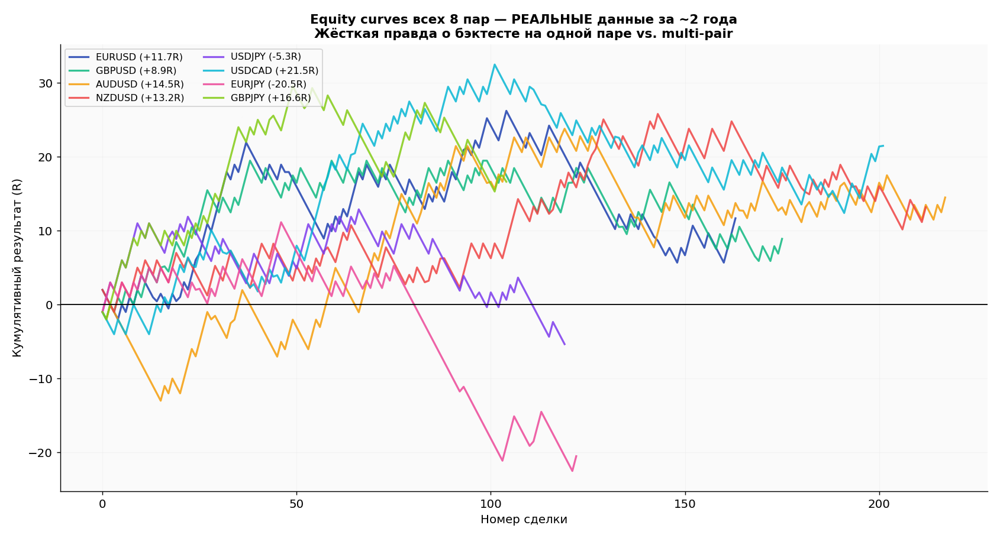

# Реальный технический анализ EUR/USD

!!! info "🌐 Перевод / Translation"
    EN/UZ-версия в работе — страница пока доступна на русском.
    *English / Oʻzbek version is in progress; this page is currently Russian-only.*

> Все графики ниже построены на **настоящих исторических данных EUR/USD H1** (1-часовые свечи), скачанных через yfinance. Никакой синтетики.

---

## EMA 50 / EMA 200 — Тренд

Две скользящие средние — основа трендовой торговли. Когда EMA50 выше EMA200 — бычий тренд. Ниже — медвежий.



**Что видим:**
- Синяя линия (EMA50) быстрее реагирует на движение
- Красная (EMA200) — медленный фильтр тренда
- Пересечение снизу вверх = сигнал к покупке (Golden Cross)
- Пересечение сверху вниз = сигнал к продаже (Death Cross)

---

## RSI(14) — Перекупленность / Перепроданность

RSI измеряет силу движения. Выше 70 — рынок перекуплен (возможен откат вниз). Ниже 30 — перепродан (возможен отскок вверх).



**Что видим:**
- Красные зоны сверху (>70) = сигнал осторожности для покупателей
- Зелёные зоны снизу (<30) = зона интереса для покупки
- RSI лучше работает в боковике, в сильном тренде даёт ложные сигналы

---

## Bollinger Bands (20, 2) — Волатильность

Полосы Боллинджера показывают «нормальный» диапазон цены. Выход за полосу = экстремум, цена часто возвращается к середине.



**Что видим:**
- Полосы сужаются перед сильным движением (сжатие волатильности)
- Расширяются во время тренда
- Касание верхней полосы ≠ сигнал к продаже, нужно подтверждение

---

## MACD (12, 26, 9) — Импульс тренда

MACD показывает разницу между двумя EMA. Пересечение MACD и сигнальной линии — сигналы входа.



**Что видим:**
- Синяя линия (MACD) пересекает оранжевую (сигнальная) снизу вверх → бычий сигнал
- Гистограмма зелёная = растущий импульс, красная = падающий
- Расхождение цены и MACD (дивергенция) = сильный сигнал разворота

---

## Реальный торговый сигнал — Вход, SL, TP

Вот как выглядит настоящий сигнал EMA50 pullback: цена в бычьем тренде, откатилась к EMA50, свеча подтверждает вход.



**Что видим:**
- Зелёная пунктирная линия = цена входа
- Красная пунктирная линия = стоп-лосс (за ближайший экстремум)
- Зелёная пунктирная линия = тейк-профит (R:R 1:2)

---

## Equity Curves — 8 Валютных Пар (Честный результат)

Это результат бэктеста **одной стратегии (EMA50 pullback)** на 8 разных парах за ~2 года реальных данных.



!!! warning "Важный урок"
    Средний Profit Factor = **1.07** — это почти безубыток. Ни одна пара не дала PF ≥ 1.5.
    
    **Вывод:** стратегия, которая хорошо работает на EUR/USD, не обязательно работает на других парах. Именно поэтому нельзя доверять бэктесту только на одной паре.

---

## Как запустить анализ самому

Все скрипты уже в проекте:

```bash
# Скачать свежие данные (8 пар × 2 таймфрейма)
python advanced/download_all_pairs.py

# Перегенерировать все 6 графиков на новых данных
python tools/chart_generator_real.py

# Запустить мультипарный бэктест
python advanced/multi_pair_backtest.py

# Экономический календарь сегодня (Forex Factory)
python tools/news_scraper.py
```

---

## Экономический календарь (Forex Factory)

У нас есть скрипт `tools/news_scraper.py`, который скачивает важные события сегодня:

```bash
# Показать важные события сегодня
python tools/news_scraper.py

# Завтра
python tools/news_scraper.py --date tomorrow

# На эту неделю
python tools/news_scraper.py --date this-week
```

События с красной иконкой (высокое влияние) — самые важные. Это:
- **NFP** (Non-Farm Payrolls) — каждую первую пятницу месяца
- **Решения ФРС / ЕЦБ** по ставкам
- **CPI** (инфляция)
- **GDP** (ВВП)

!!! tip "Правило новичка"
    Не торгуй за 30 минут до и 30 минут после красных событий. Волатильность резко возрастает и стоп-лосс может сорвать без нормального движения.
