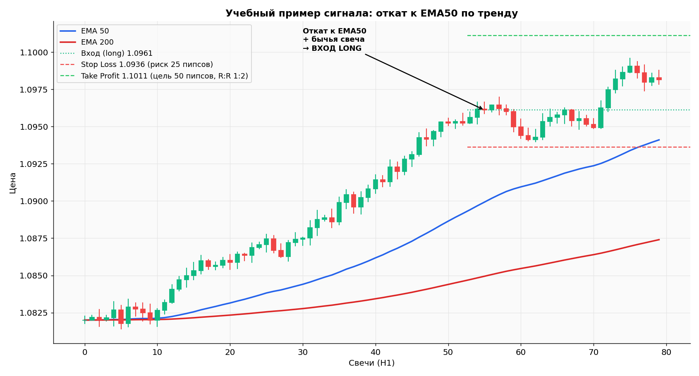

# Стратегия «Откат к EMA50 по тренду» — детальный разбор

!!! info "🌐 Перевод / Translation"
    EN/UZ-версия в работе — страница пока доступна на русском.
    *English / Oʻzbek version is in progress; this page is currently Russian-only.*

> **Это учебная стратегия, не Грааль.** Цель — показать структуру торгового подхода: правила, риск-менеджмент, проверка. Любую стратегию ты обязан **протестировать на демо ≥ 100 сделок** перед реальной торговлей.

## Оглавление

1. [Идея стратегии](#1-идея-стратегии)
2. [Что такое полная торговая система](#2-что-такое-полная-торговая-система)
3. [Параметры стратегии](#3-параметры-стратегии)
4. [Условия входа Long](#4-условия-входа-long)
5. [Условия входа Short](#5-условия-входа-short)
6. [Выход из сделки](#6-выход-из-сделки)
7. [Управление позицией](#7-управление-позицией)
8. [Иллюстрация на графике](#8-иллюстрация-на-графике)
9. [Бэктест и форвард-тест](#9-бэктест-и-форвард-тест)
10. [Когда стратегия НЕ работает](#10-когда-стратегия-не-работает)
11. [Как улучшать стратегию через журнал](#11-как-улучшать-стратегию-через-журнал)

---

## 1. Идея стратегии

**Купить дешевле, продать дороже** — банально, но именно за этим логика стратегии.

**В сильном тренде цена не идёт по прямой**: она делает импульсы и откаты. Эта стратегия ловит **откаты в сторону тренда**, а не самые экстремумы.

Логика:
- Если тренд восходящий (цена выше EMA200 на старшем таймфрейме) — **мы только покупаем**.
- Покупаем не на пиках, а на **откатах к динамической поддержке** (EMA50).
- Используем свечной паттерн как подтверждение, что откат закончился.

Это **тренд-следящая стратегия** (trend-following). Она проигрывает в боковике, но даёт хорошие R:R в тренде.

---

## 2. Что такое полная торговая система

Любая стратегия — это набор **6 чётких правил**:

| # | Что определяем | Пример из нашей стратегии |
|---|---|---|
| 1 | **Когда смотреть рынок** | После закрытия каждой свечи H1 |
| 2 | **На каком рынке торговать** | EUR/USD, GBP/USD — мажоры |
| 3 | **В какую сторону торговать** | Только по тренду H4 |
| 4 | **Условия входа** | Откат к EMA50 + бычий паттерн |
| 5 | **Где стоп-лосс** | За последний свинг-минимум + 5 пипсов |
| 6 | **Где тейк-профит** | 2× расстояние до стопа, R:R 1:2 |

**Без всех 6 правил — это не стратегия, это импровизация.**

---

## 3. Параметры стратегии

```yaml
Название: "EMA50 Pullback by Trend"
Тип: Trend-following
Рынки: EUR/USD, GBP/USD (только мажоры, низкий спред)
Время торговли: Лондонская + американская сессия (12:00–22:00 UTC+3)
                Избегать азиатской (низкая ликвидность), пятничного вечера

Таймфреймы:
  - Тренд: H4
  - Точка входа: H1

Индикаторы:
  - EMA(50) на H1 — динамическая поддержка/сопротивление
  - EMA(200) на H4 — главный фильтр направления
  - RSI(14) на H1 — фильтр перегрева

Риск-менеджмент:
  - Риск на сделку: 0.5% депозита (новичок) или 1% (опыт ≥ 6 мес)
  - R:R минимум 1:2
  - Максимум 2 открытые сделки одновременно
  - Максимум 3 убыточные сделки в день → стоп на день
  - Максимум 6% просадки за неделю → пауза до понедельника
```

---

## 4. Условия входа Long

**ВСЕ условия должны выполниться. Если хотя бы одно нет — сделки НЕТ.**

### Шаг 1. Фильтр тренда (H4)
- ☐ Текущая цена **выше EMA(200) на H4**
- ☐ Структура H4 — серия higher highs / higher lows (восходящий тренд)
- ☐ Нет серьёзного сопротивления на H4 в ближайших 50 пипсах сверху

### Шаг 2. Откат на H1
- ☐ Цена опустилась к EMA(50) на H1 — касание или близко (в пределах 10 пипсов)
- ☐ Откат произошёл **после восходящего импульса**, а не из бокового движения

### Шаг 3. Сигнал свечи на H1
Нужен **минимум один** из бычьих паттернов рядом с EMA50:
- ☐ Молот (длинная нижняя тень, маленькое тело сверху, цвет любой)
- ☐ Бычье поглощение (зелёная свеча покрыла тело красной)
- ☐ Доджи на EMA50 + следующая зелёная свеча
- ☐ Бычий пин-бар

### Шаг 4. Фильтр RSI
- ☐ RSI(14) на H1 находится в зоне **40–65**
  - Меньше 40 — слишком слабая структура, лучше пропустить
  - Больше 65 — уже перегрет, стоп будет слишком большим

### Шаг 5. Новостной фильтр
- ☐ В ближайшие 2 часа **нет красных** новостей по EUR или USD
- ☐ Это не пятница после 18:00 UTC+3

### Если ВСЕ 5 шагов ☑ — открываем long.

---

## 5. Условия входа Short

Зеркальное отражение long:

### Шаг 1. Фильтр тренда (H4)
- ☐ Цена **ниже EMA(200) на H4**
- ☐ Структура H4 — серия lower highs / lower lows

### Шаг 2. Откат на H1
- ☐ Цена поднялась к EMA(50) на H1 снизу

### Шаг 3. Сигнал свечи на H1
- ☐ Падающая звезда (длинная верхняя тень)
- ☐ Медвежье поглощение
- ☐ Доджи + следующая красная свеча
- ☐ Медвежий пин-бар

### Шаг 4. Фильтр RSI
- ☐ RSI(14) в зоне **35–60**

### Шаг 5. Новостной фильтр
- ☐ Нет красных новостей в ближайшие 2 часа

---

## 6. Выход из сделки

### Stop Loss

**Для long:**
- За последним свинг-минимумом (последнее локальное дно перед сигналом) **минус 5 пипсов**
- Расстояние от входа до стопа = `Stop Distance` (в пипсах)

**Для short:**
- За последним свинг-максимумом плюс 5 пипсов

> **⚠️ Стоп НЕ ставится «на 20 пипсов потому что так захотелось».** Стоп — это **технический уровень**, его пробой означает, что твоя гипотеза о тренде неверна.

### Take Profit — три варианта

**Вариант А: Фиксированный R:R = 1:2 (для новичков)**
```
TP = вход + 2 × Stop Distance  (для long)
TP = вход − 2 × Stop Distance  (для short)
```

**Вариант Б: До ближайшего значимого уровня сопротивления (H4)**
- Использовать, когда впереди есть очевидное препятствие
- Проверь, что R:R хотя бы 1:1.5

**Вариант В: Trailing stop**
- После прохода 1R прибыли — перенос стопа в безубыток (на цену входа)
- После прохода 2R — перенос стопа под/над последний свинг-low/high

**Рекомендация:** первые 50 сделок — только **вариант А**. Это даёт чистые данные для статистики.

### Время в сделке

- Если сделка не двинулась в любую сторону за **6 часов** → закрыть руками. Импульс выдохся.
- Не оставляй позицию через выходные (закрой к пятнице 22:00 UTC+3) — гэп в понедельник может пробить стоп.

---

## 7. Управление позицией

### Расчёт размера позиции

Формула:

```
Размер позиции (лоты) = (Депозит × Риск%) / (Stop Distance × Стоимость пипса за 1 лот)
```

**Пример:**
- Депозит: $1 000
- Риск: 0.5% = $5
- Stop Distance: 25 пипсов
- Стоимость 1 пипса на 1 лот EUR/USD: $10

```
Размер = $5 / (25 × $10) = $5 / $250 = 0.02 лота
```

Открываем **0.02 лота** (мини × 0.02 = микро 0.02).

**Используй калькулятор:** `tools/position_calculator.py` (есть в этой папке) — посчитает за тебя.

### Стоимость пипса по валютам (приблизительно, для счёта в USD)

| Пара | Стоимость 1 пипса на 1 лот |
|---|---|
| EUR/USD | $10 |
| GBP/USD | $10 |
| AUD/USD | $10 |
| USD/JPY | ~$6.7 (зависит от курса) |
| USD/CHF | ~$11 (зависит от курса) |

**Точный расчёт лучше делать через калькулятор или встроенный инструмент терминала.**

### Что НЕ делать

- ❌ Открывать больше 2 позиций одновременно
- ❌ Усреднять убыточную позицию («докупить, чтобы средняя была лучше»)
- ❌ Двигать стоп **дальше** от цены, чтобы «дать сделке шанс»
- ❌ Закрывать прибыльную сделку раньше TP «потому что боюсь, что развернётся» (если по правилам — держим до TP или SL)

---

## 8. Иллюстрация на графике

Учебный пример с явным сигналом:



**Что видим:**

1. **Восходящий тренд:** цена движется от 1.0820 к 1.097+, EMA50 (синяя) и EMA200 (красная) расходятся вверх — классическая тренд-структура.
2. **Откат к EMA50:** на свечах 52–55 цена откатилась к EMA50 после восходящего импульса.
3. **Бычья свеча подтверждения** на свече 55.
4. **Точка входа:** 1.0961 (после закрытия сигнальной свечи).
5. **Stop Loss:** 1.0936 (25 пипсов риска, за последний свинг-минимум).
6. **Take Profit:** 1.1011 (50 пипсов, R:R = 1:2).

При риске 0.5% от депозита $1000 (= $5) и стопе 25 пипсов:
```
Размер позиции = 5 / (25 × 10) = 0.02 лота
Потенциальная прибыль = 50 × 10 × 0.02 = $10
Соотношение = $5 риск / $10 прибыль = 1:2 ✓
```

---

## 9. Бэктест и форвард-тест

Прежде чем торговать на демо, прогони стратегию на истории.

### Ручной бэктест на TradingView (бесплатно)

1. Открой график EUR/USD на H1 за последние 3 месяца.
2. **Отмотай на начало периода** (используй инструмент Replay — «Перемотка»).
3. Прогоняй свечи по одной. На каждой свече задавай себе вопрос:
   > Выполнены ли все 5 условий стратегии?
4. Если да — отмечай вход (стрелка), стоп, тейк прямо на графике.
5. Записывай результат в журнал.

**Цель:** минимум 50 сделок за 3–6 месяцев истории.

### Что считать после бэктеста

| Метрика | Формула | Что хорошо |
|---|---|---|
| **Win rate** | Прибыльные / Всего | ≥ 40% |
| **Avg Win** | Сумма прибылей / Кол-во прибыльных | — |
| **Avg Loss** | Сумма убытков / Кол-во убыточных | — |
| **Profit Factor** | Сумма прибылей / Сумма убытков | ≥ 1.5 |
| **Expectancy** | (Win Rate × Avg Win) − (Loss Rate × Avg Loss) | > 0 |
| **Max Drawdown** | Макс. просадка от пика | < 15% депозита |

Если **Profit Factor < 1.2 или Expectancy < 0** — стратегия не работает в текущем виде, дорабатывай.

### Форвард-тест на демо

После хорошего бэктеста:
- Минимум **30 сделок на демо** в реальном времени
- Если результат совпадает с бэктестом → переход на реал
- Если хуже → разбирайся: возможно, ты в реальности нарушаешь свои же правила

---

## 10. Когда стратегия НЕ работает

**Никакая стратегия не работает всегда.** Любая trend-following стратегия плохо себя ведёт в:

### Боковик (флэт)
- EMA50 и EMA200 на H4 переплетаются и идут горизонтально
- Цена скачет между уровнями
- Серия ложных сигналов → серия убытков

**Решение:** не торгуй в эти периоды. Признак флэта — EMA200 на H4 имеет **наклон менее 5°** на протяжении 2–3 дней.

### Новостные дни (FOMC, NFP)
- Резкие движения на 50–100 пипсов за минуту
- Стопы выбиваются спайками
- Спреды расширяются в 3–5 раз

**Решение:** не открывать сделки за 2 часа до и после красных новостей. Закрыть открытые позиции перед NFP, если профит уже взят.

### Низкая ликвидность
- Азиатская сессия (22:00–08:00 UTC+3) на EUR/USD
- Пятница вечер
- Праздники (Рождество, Новый Год, Дни благодарения)

**Решение:** торговать только в лондонско-американское окно.

### Изменение режима рынка
Иногда рынок меняет «характер» — например, был тренд, стал шумный флэт. Если за последние 20 сделок Profit Factor упал ниже 1.0:
- Поставь стратегию на паузу
- Перепроверь бэктест на свежих данных
- Может потребоваться донастройка параметров

---

## 11. Как улучшать стратегию через журнал

**Журнал сделок (см. `journal/`) — самый мощный инструмент роста.**

### Раз в неделю
- Подсчитай win rate, profit factor за неделю
- Найди **3 худшие сделки** — что в них общего?
- Найди **3 лучшие сделки** — что в них общего?

### Раз в месяц
- Открой 20 последних сделок и раздели на:
  - По правилам, прибыль
  - По правилам, убыток
  - Нарушение правил, прибыль (опасно — «случайно повезло»)
  - Нарушение правил, убыток (классика)
- Если много нарушений → проблема не в стратегии, а в дисциплине

### Раз в 3 месяца
- Пересмотри параметры: может, RSI-фильтр слишком жёсткий и режет хорошие сетапы?
- Тестируй изменения **только на новых сделках** (на бумаге или демо)
- Не меняй больше одного параметра за раз

### Признак того, что стратегия зрелая

- Стабильный win rate ± 5% месяц к месяцу
- Profit Factor стабильно ≥ 1.3
- Просадка контролируется (нет «месяца провала» с −15%)
- Ты можешь спокойно пропустить сделку, если она «не идеальна»

---

[← Назад к основному гайду](../forex-guide.md) · [← Технический анализ](technical-analysis.md)
