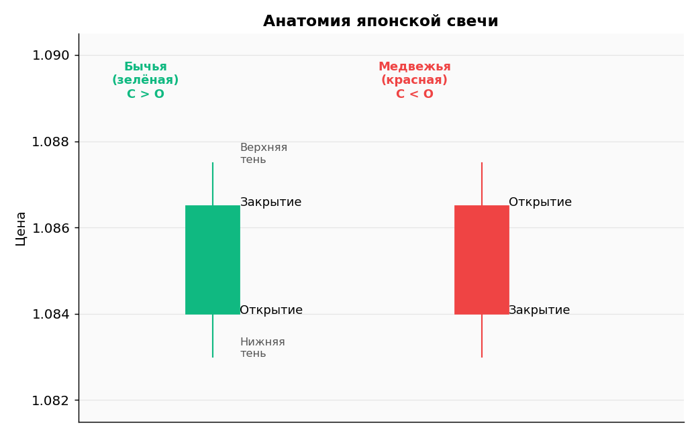
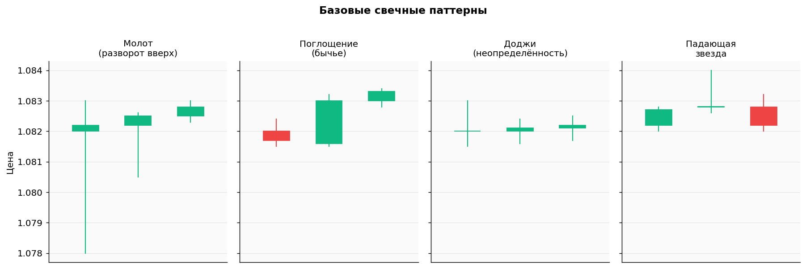
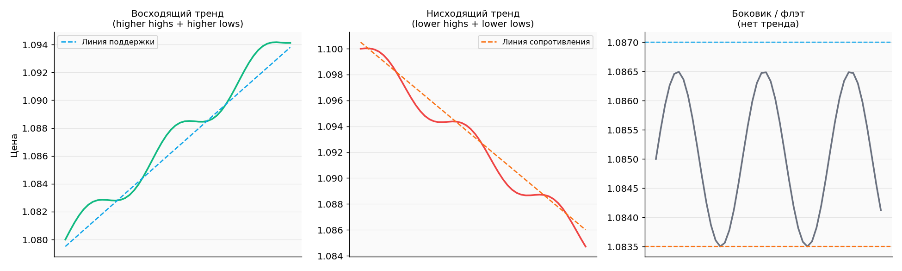
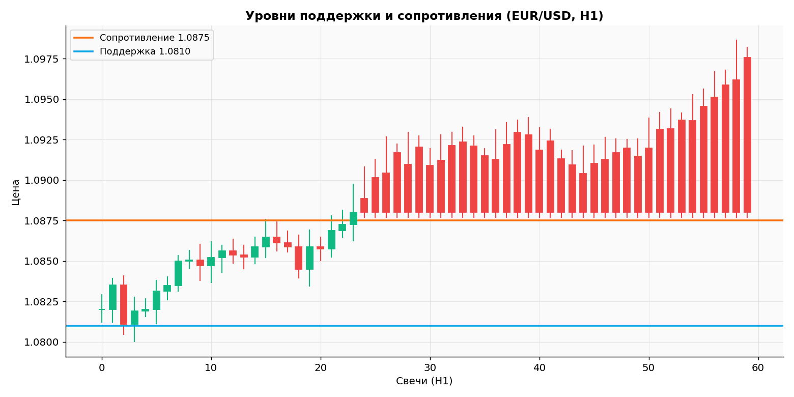
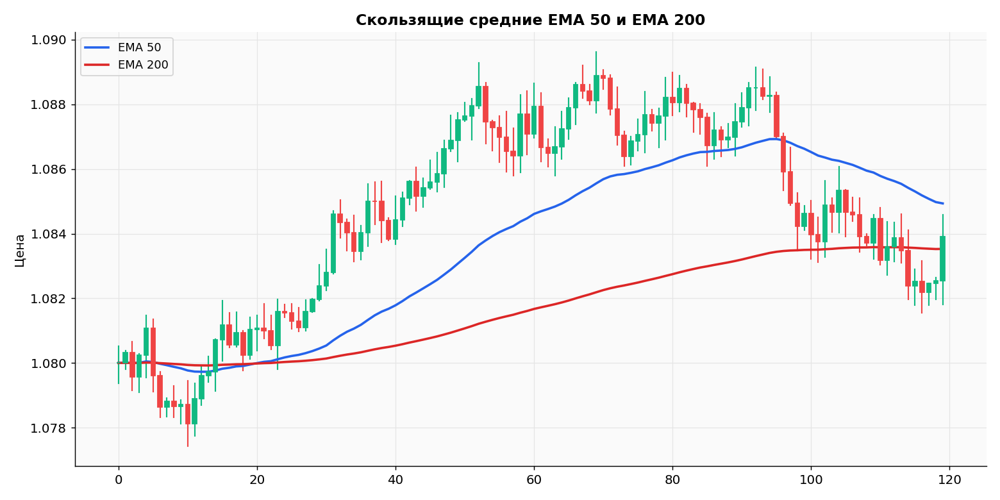
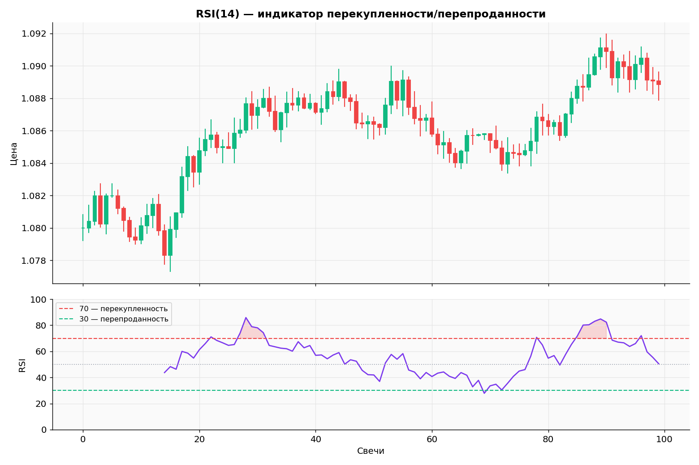
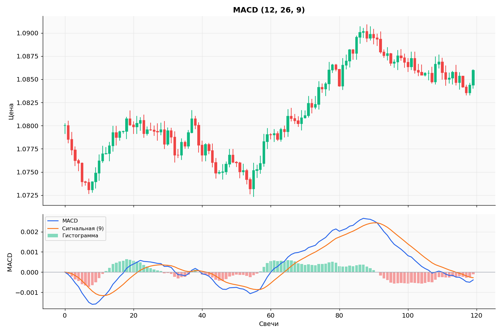
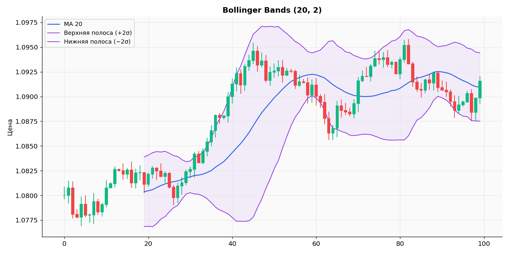
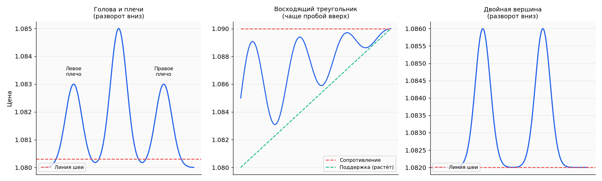

# Технический анализ — расширенный гайд

!!! info "🌐 Перевод / Translation"
    EN/UZ-версия в работе — страница пока доступна на русском.
    *English / Oʻzbek version is in progress; this page is currently Russian-only.*

> **Учебный материал.** Все графики — синтетические данные для иллюстрации концепций. Это не сигналы и не прогнозы реального рынка.

## Оглавление

1. [Идея технического анализа](#1-идея-технического-анализа)
2. [Японские свечи: анатомия](#2-японские-свечи-анатомия)
3. [Свечные паттерны разворота](#3-свечные-паттерны-разворота)
4. [Тренды](#4-тренды)
5. [Поддержка и сопротивление](#5-поддержка-и-сопротивление)
6. [Скользящие средние (MA / EMA)](#6-скользящие-средние-ma--ema)
7. [RSI — индекс относительной силы](#7-rsi--индекс-относительной-силы)
8. [MACD](#8-macd)
9. [Bollinger Bands](#9-bollinger-bands)
10. [Графические паттерны](#10-графические-паттерны)
11. [Multi-timeframe analysis (MTF)](#11-multi-timeframe-analysis-mtf)
12. [Как НЕ нагромождать индикаторы](#12-как-не-нагромождать-индикаторы)
13. [Чек-лист анализа графика](#13-чек-лист-анализа-графика)

---

## 1. Идея технического анализа

Технический анализ (TA) исходит из трёх постулатов Чарльза Доу:

1. **Цена учитывает всё** — все новости, отчёты, эмоции уже встроены в текущую котировку.
2. **Цена движется трендами** — рынок не случаен, он формирует направления.
3. **История повторяется** — паттерны поведения толпы воспроизводятся, потому что психология людей за 100+ лет не изменилась.

Не нужно верить в TA как в «магию». Это **язык для описания** того, что делает цена. Хороший трейдер использует TA как карту, а не как хрустальный шар.

---

## 2. Японские свечи: анатомия

Свеча — графическое представление цены за один период (M1, M5, H1, H4, D1…).



**Четыре цены, образующие свечу — OHLC:**

| Сокр. | Что это |
|---|---|
| **O** (Open) | Цена в момент открытия периода |
| **H** (High) | Максимальная цена за период |
| **L** (Low) | Минимальная цена за период |
| **C** (Close) | Цена в момент закрытия периода |

**Тело** — прямоугольник между Open и Close.
- Если `Close > Open` — свеча **бычья** (зелёная/белая).
- Если `Close < Open` — свеча **медвежья** (красная/чёрная).

**Тени (фитили)** — линии сверху и снизу тела, до High и Low. Они показывают, **куда ходила цена, но не удержалась**.

### Что читать со свечи

- **Большое тело без теней** → сильное движение, контроль одной стороны
- **Длинная нижняя тень + маленькое тело сверху** → продавцы давили, но покупатели вернули цену → возможный разворот вверх
- **Длинная верхняя тень + маленькое тело снизу** → покупатели не удержали → возможный разворот вниз
- **Маленькое тело, длинные тени с обеих сторон** → неопределённость, борьба

---

## 3. Свечные паттерны разворота

Паттерны работают **в контексте**, а не сами по себе. Молот на нисходящем тренде у уровня поддержки — сигнал. Тот же молот посреди боковика — шум.



### Молот (Hammer)
- Маленькое тело сверху, длинная нижняя тень (≥ 2× тела)
- Появляется **в конце нисходящего движения**
- Покупатели перехватили контроль
- Подтверждение — следующая бычья свеча

### Бычье поглощение (Bullish Engulfing)
- Маленькая медвежья свеча, потом большая бычья, **тело которой полностью покрывает** тело предыдущей
- Появляется **в конце нисходящего движения**
- Сильный сигнал смены настроения

### Доджи (Doji)
- Open ≈ Close, длинные тени
- **Неопределённость** — бычий и медвежий контроль уравновесились
- Доджи на ключевом уровне после долгого тренда — частый предвестник разворота
- Доджи в шуме боковика — игнорировать

### Падающая звезда (Shooting Star)
- Маленькое тело снизу, длинная верхняя тень
- Появляется **в конце восходящего движения**
- Зеркальное отражение молота, сигнал разворота вниз

### Правила использования паттернов

1. **Контекст важнее формы.** Паттерн должен быть в нужном месте: на уровне, после тренда.
2. **Ждать подтверждения** — закрытия следующей свечи в нужную сторону.
3. **Чем больше таймфрейм, тем надёжнее** паттерн. На M1 — шум. На H4/D1 — серьёзный сигнал.
4. **Никогда не торговать только по паттерну** — добавляй индикаторы и контекст.

---

## 4. Тренды

Тренд — это направление цены за период.



### Восходящий тренд (Uptrend)
**Признак:** последовательность **higher highs (HH) и higher lows (HL)** — каждый следующий пик выше предыдущего, каждое следующее дно выше предыдущего.

Стратегия: торговать **только в long**, входить на откатах к поддержке (трендовой линии, EMA).

### Нисходящий тренд (Downtrend)
**Признак:** **lower highs (LH) и lower lows (LL)** — каждый пик ниже, каждое дно ниже.

Стратегия: торговать **только в short**, входить на откатах к сопротивлению.

### Боковик / флэт (Range)
**Признак:** цена движется в горизонтальном коридоре между уровнями.

Стратегия: покупать у поддержки, продавать у сопротивления. **Опасно для новичков** — лучше пропускать.

### Главное правило тренда

> **The trend is your friend until it bends.**
>
> Тренд — твой друг, пока не сломается.

**Не пытайся «поймать дно» в нисходящем тренде** — это одна из главных причин слива депозитов у новичков. Жди разворота (структурного), потом входи.

### Как определить смену тренда

Восходящий тренд считается сломанным, когда цена сделала **lower low** — нижний минимум ниже предыдущего минимума. И наоборот для нисходящего.

---

## 5. Поддержка и сопротивление

Это **горизонтальные уровни цены**, которые рынок «помнит». Психологически: на этих ценах было много сделок в прошлом → много участников будут реагировать снова.



- **Поддержка** — уровень, от которого цена отскакивала ВВЕРХ. Покупатели активны.
- **Сопротивление** — уровень, от которого цена отскакивала ВНИЗ. Продавцы активны.

### Как находить уровни

1. На дневном (D1) или 4-часовом (H4) графике найди **локальные максимумы и минимумы**, где цена разворачивалась минимум 2 раза.
2. Проведи **горизонтальную линию** через эти точки (или зону, если разворот был не идеально точно по цене).
3. Чем больше касаний — тем сильнее уровень.

### Принцип смены ролей

> **После пробоя поддержка становится сопротивлением, и наоборот.**

Если цена пробила поддержку 1.0810 вниз — теперь 1.0810 будет работать как сопротивление при возврате.

### Как торговать от уровней

**Вариант 1: отскок (ребаунд)**
- Цена подходит к сильному уровню
- На младшем таймфрейме — свечной паттерн разворота
- Вход с маленьким стопом за уровень

**Вариант 2: пробой (breakout)**
- Цена пробивает уровень сильной свечой (большое тело, большой объём)
- Ждать **ретеста** — возврат к уровню снизу/сверху
- Вход на отскоке от ретеста в направлении пробоя

---

## 6. Скользящие средние (MA / EMA)

Скользящая средняя — **сглаженная цена** за N последних периодов. Помогает определять тренд и уровни.



### Типы скользящих средних

- **SMA (Simple Moving Average)** — простое среднее цен закрытия. Реагирует медленно.
- **EMA (Exponential Moving Average)** — экспоненциальное среднее, **последние свечи весят больше**. Реагирует быстрее. **Чаще используется в трейдинге.**

### Популярные периоды

| Период | Что показывает |
|---|---|
| EMA 9 / 21 | Краткосрочный тренд, для скальпинга |
| **EMA 50** | Среднесрочный тренд, **динамическая поддержка/сопротивление** |
| **EMA 200** | Долгосрочный тренд. **Главный «фильтр»**: цена выше EMA200 = long-bias, ниже = short-bias |

### Как использовать

**1. Фильтр направления**
- Цена > EMA200 → торговать только long
- Цена < EMA200 → торговать только short

**2. Динамическая поддержка/сопротивление**
- В восходящем тренде цена откатывается к EMA50 и отскакивает → точка входа
- В нисходящем — наоборот

**3. Пересечения (Crossovers)**
- **Золотой крест (Golden Cross):** EMA50 пересекает EMA200 снизу вверх → бычий сигнал
- **Мёртвый крест (Death Cross):** EMA50 пересекает EMA200 сверху вниз → медвежий сигнал

> **⚠️ Запаздывание.** MA всегда отстаёт от цены, потому что считается по прошлым данным. На быстрых рынках сигнал приходит после движения. Не используй MA как единственный фильтр.

---

## 7. RSI — индекс относительной силы

**RSI (Relative Strength Index)** — осциллятор от 0 до 100. Показывает, насколько цена «перекуплена» или «перепродана».



### Формула (упрощённо)
```
RSI = 100 - 100 / (1 + RS)
RS  = средний прирост за N периодов / средний убыток за N периодов
```

Стандартный период — **14**.

### Зоны

| Значение | Интерпретация |
|---|---|
| RSI > 70 | **Перекупленность** — возможен откат вниз |
| RSI 50–70 | Бычье давление |
| RSI 30–50 | Медвежье давление |
| RSI < 30 | **Перепроданность** — возможен отскок вверх |

### Как НЕ использовать RSI

❌ «RSI > 70 — продаём, RSI < 30 — покупаем» — на сильном тренде RSI может оставаться в зоне 70+ неделями, и шорт по нему = верное поражение.

### Как использовать RSI правильно

**1. Подтверждение точки входа на откате**
- В восходящем тренде ждём отката
- Если RSI спустился ближе к 40–45 и развернулся вверх → импульс восстанавливается → возможный вход

**2. Дивергенция (расхождение)** — мощный сигнал
- **Бычья дивергенция:** цена делает новый минимум, а RSI — нет (выше предыдущего минимума). → ослабление продаж, возможен разворот вверх.
- **Медвежья дивергенция:** цена делает новый максимум, RSI — нет. → ослабление покупок, возможен разворот вниз.

```
Цена:  /\    /\
      /  \  /  \      ← новый максимум (выше)
     /    \/    \
                 \

RSI:   /\
      /  \  /\        ← НИЖЕ предыдущего максимума
     /    \/  \       = медвежья дивергенция
              \
```

**3. Фильтр перегрева**
- Не входить в long, если RSI > 75 (даже если есть сигнал)
- Не входить в short, если RSI < 25

---

## 8. MACD

**MACD (Moving Average Convergence Divergence)** — тренд + моментум в одном инструменте.



### Компоненты

```
Линия MACD = EMA(12) - EMA(26)
Сигнальная линия = EMA(9) от MACD
Гистограмма = MACD - сигнальная
```

### Сигналы

**1. Пересечение MACD и сигнальной**
- MACD пересекает сигнальную **снизу вверх** → бычий сигнал
- MACD пересекает сигнальную **сверху вниз** → медвежий сигнал
- **На сильном флэте даёт ложные сигналы** — фильтруй трендом

**2. Пересечение нулевой линии**
- MACD выше 0 → быки контролируют
- MACD ниже 0 → медведи контролируют
- Пересечение 0 снизу вверх = усиление бычьего тренда

**3. Дивергенция** (как у RSI)
- Цена делает новый экстремум, MACD — нет → ослабление, возможен разворот

### Когда не работает MACD

- На **малых таймфреймах** (M1–M15) — слишком много шума
- На **флэтовом рынке** — даёт серию ложных пересечений
- **На сильных трендах** опаздывает с входом

---

## 9. Bollinger Bands

**Bollinger Bands** — индикатор волатильности. Три линии:



- **Средняя** — SMA(20) — обычное скользящее среднее
- **Верхняя** = SMA(20) + 2 × стандартное отклонение цены
- **Нижняя** = SMA(20) − 2 × стандартное отклонение

Цена статистически **95% времени находится между полосами**.

### Что показывают полосы

- **Узкие полосы (squeeze)** — низкая волатильность → скоро **взрыв движения** (но направление не известно!)
- **Расширенные полосы** — высокая волатильность → возможен возврат к средней
- **Касание верхней полосы** — относительно высокая цена для текущего диапазона
- **Касание нижней полосы** — относительно низкая цена

### Стратегии с Bollinger Bands

**1. Возврат к среднему (mean reversion) — для флэта**
- Цена коснулась нижней полосы → ищем long
- Цена коснулась верхней → ищем short
- Цель — средняя линия
- **Работает ТОЛЬКО на флэте**, на тренде убьёт

**2. Прорыв из squeeze**
- Полосы максимально сузились
- Ждём резкой свечи, которая пробьёт одну из полос
- Входим в направлении пробоя
- Стоп — за противоположной полосой

**3. «Хождение по полосе» (walking the band)**
- Сильный тренд → цена идёт ВДОЛЬ верхней (long) или нижней (short) полосы
- Это **признак силы тренда**, а не сигнал на разворот
- Распространённая ошибка новичков: шортить, потому что «коснулась верхней полосы»

---

## 10. Графические паттерны

Это формы, которые цена рисует на графике месяцами психологии участников.



### Голова и плечи (Head & Shoulders)
**Разворотный** паттерн вершины:
- Левое плечо → откат → голова (выше) → откат → правое плечо (примерно на уровне левого)
- **Линия шеи** (neckline) — поддержка под плечами
- Пробой линии шеи вниз = сигнал на short
- **Цель** = расстояние от вершины головы до шеи, отложенное вниз от шеи

Зеркальный паттерн — **обратные голова и плечи** (внизу, перед ростом).

### Двойная вершина / двойное дно
**Разворотный**:
- Цена два раза пытается пробить уровень, не получается
- Двойная вершина = сигнал на short после пробоя линии шеи
- Двойное дно = сигнал на long

Чем больше расстояние между вершинами/днами по времени — тем сильнее паттерн.

### Треугольники
**Продолжение тренда:**
- **Восходящий треугольник** — горизонтальное сопротивление сверху, восходящая поддержка снизу. Чаще пробой вверх.
- **Нисходящий треугольник** — горизонтальная поддержка, нисходящее сопротивление. Чаще пробой вниз.
- **Симметричный треугольник** — обе стороны сходятся. Пробой в любую сторону, направление не предсказывается заранее.

### Флаг / вымпел
**Продолжение тренда:**
- Сильный импульс → короткий боковой/наклонный консолидатор → продолжение в направлении импульса
- Самый «торгуемый» паттерн на интрадей

### Важно про паттерны

⚠️ **Паттерны субъективны.** Один и тот же график 5 трейдеров увидят по-разному. Поэтому:

1. Подтверждай **пробоем уровня** (не верь «формирующемуся» паттерну)
2. Ставь стоп **за противоположную сторону паттерна**
3. Целью бери **высоту паттерна**, отложенную от точки пробоя
4. Не натягивай линии — если паттерн неочевиден, его, скорее всего, нет

---

## 11. Multi-timeframe analysis (MTF)

Один и тот же график выглядит по-разному на M1, H1 и D1. Профессионалы анализируют **минимум 3 таймфрейма**.

### Рекомендуемая связка для свинг-трейдинга

| Таймфрейм | Что определяем |
|---|---|
| **D1 (дневной)** | Главный тренд, ключевые уровни поддержки/сопротивления |
| **H4 (4-часовой)** | Среднесрочный тренд, рабочие уровни, EMA200 |
| **H1 (часовой)** | Точка входа, свечной паттерн, EMA50 |
| ~~M5/M1~~ | **Игнорировать новичку** — шум, эмоции |

### Правило согласования

**Сделку открывать только когда все таймфреймы говорят одно и то же.**

Пример long-сетапа:
- D1: восходящий тренд (HH/HL)
- H4: цена выше EMA200, откатилась к зоне поддержки
- H1: бычий паттерн (молот, поглощение) от EMA50

Если D1 нисходящий, а H1 рисует «бычий разворот» — это **контр-тренд** и почти всегда ловушка.

---

## 12. Как НЕ нагромождать индикаторы

Распространённая ошибка: открыть платформу и навесить 7 индикаторов «для надёжности». Это:
- замедляет принятие решений,
- создаёт **иллюзию контроля**,
- даёт противоречивые сигналы (один говорит buy, другой sell — паралич),
- не повышает точность.

### Минимальный набор для новичка

1. **Цена + свечи** (всегда)
2. **EMA 50 и EMA 200** (тренд и динамическая поддержка)
3. **RSI(14)** (фильтр перегрева, дивергенции) ИЛИ **MACD** — выбери что-то одно
4. **Горизонтальные уровни поддержки/сопротивления** — рисуешь сам

Этого хватит минимум на год торговли.

### Что добавлять (только после уверенного использования базы)

- Fibonacci retracement — для определения целей откатов (38.2%, 50%, 61.8%)
- Pivot Points — внутридневные уровни
- Volume Profile — где была наибольшая ликвидность
- ATR — для расчёта стопов по волатильности

---

## 13. Чек-лист анализа графика

Перед каждой сделкой пройди этот список:

```
─── КОНТЕКСТ ───
☐ D1: какой главный тренд? (вверх / вниз / флэт)
☐ Ключевые уровни D1 рядом?

─── НАПРАВЛЕНИЕ ───
☐ H4: цена выше или ниже EMA200?
☐ Структура H4 подтверждает тренд (HH/HL или LH/LL)?

─── ТОЧКА ВХОДА ───
☐ H1: есть откат к динамической поддержке (EMA50)?
☐ H1: свечной паттерн в нужном направлении?
☐ RSI не в крайней зоне?

─── ИСПОЛНЕНИЕ ───
☐ Стоп рассчитан и поставлен (за свинг / за уровень)?
☐ Тейк рассчитан, R:R ≥ 1:2?
☐ Размер позиции = 0.5–1% риска?

─── НОВОСТНОЙ ФИЛЬТР ───
☐ Нет красных новостей в ближайшие 2 часа?
☐ Не пятница вечером (рынок закроется)?

─── ПСИХОЛОГИЯ ───
☐ Я спокоен, не «отыгрываюсь»?
☐ Это сделка по правилам, а не интуиции?

ВСЕ ☐ ОТМЕЧЕНЫ → можно открывать.
ХОТЯ БЫ ОДИН НЕТ → НЕТ сделки.
```

Распечатай этот список и держи рядом с компьютером первые 6 месяцев торговли.

---

[← Назад к основному гайду](../forex-guide.md) · [Стратегия →](strategy-details.md)
