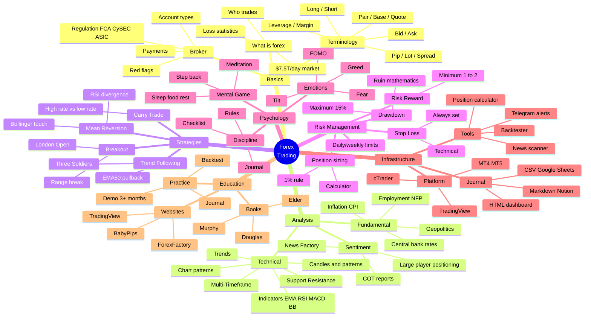

# Project Mind Map — Forex in One Picture

A complete map of concepts. Use it as a "table of contents in your head".

## Text Structure

```
                         FOREX TRADING
                              │
        ┌─────────────────────┼─────────────────────┐
        │                     │                     │
   BASICS              ANALYSIS            EXECUTION
        │                     │                     │
  ┌─────┼─────┐         ┌─────┼─────┐         ┌─────┼─────┐
  │     │     │         │     │     │         │     │     │
What  Termi- Broker  Tech.  Fund. Sentim.  Stra-  Risk- Psych-
forex nology        analysis anal. anal.   tegy   mgmt. ology
```

## Mermaid Diagram (renders in GitHub / VSCode preview)



## How to Use the Mind Map

1. **Find your "weak branch"** — the one you understand least
2. **Focus on it** for the next week
3. **Don't jump between branches** — it creates a feeling of progress without actual progress

## Branch Priorities (for beginners)

| Priority | Branch | Why |
|---|---|---|
| 🔴 CRITICAL | Risk management | Without it your deposit will blow up within a month |
| 🔴 CRITICAL | Psychology | The main long-term account killer |
| 🟡 IMPORTANT | Basics (terminology, broker) | Without these you can't even trade |
| 🟡 IMPORTANT | Tech. analysis (basics) | Candles, trends, EMA, levels |
| 🟢 USEFUL | Strategies | Once the basics are solid |
| 🟢 USEFUL | Infrastructure | As needed |
| 🔵 OPTIONAL | Fundamentals | After a year of practice |
| 🔵 OPTIONAL | Advanced tools | After achieving consistency |

## Connections Between Branches

- **Psychology ← Risk management**: small risk = calm psychology
- **Strategy ← Technical analysis**: a strategy is a set of TA rules
- **Infrastructure ← Journal**: the journal works better when it's convenient
- **All branches → Discipline**: everything is useless without it

---

[← Back to the main guide](../forex-guide.md)
