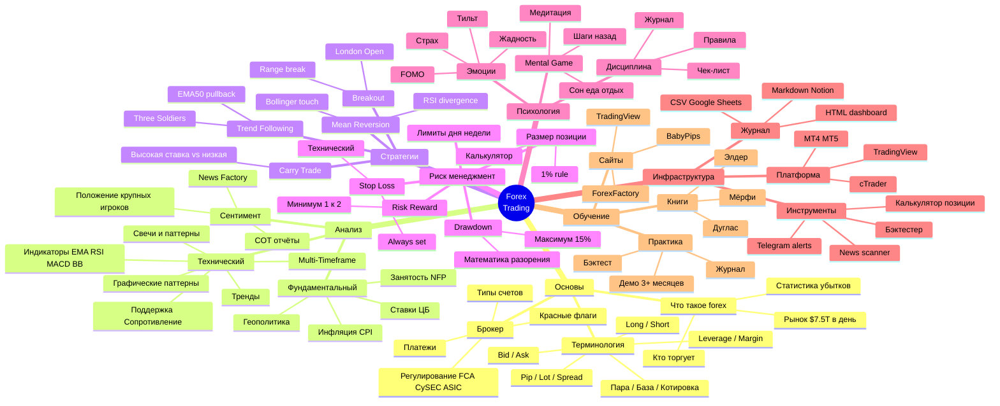

# Mind map проекта — Forex в одной картине

Полная карта концепций. Можно использовать как «оглавление в голове».

## Текстовая структура

```
                         FOREX TRADING
                              │
        ┌─────────────────────┼─────────────────────┐
        │                     │                     │
    ОСНОВЫ              АНАЛИЗ               ИСПОЛНЕНИЕ
        │                     │                     │
  ┌─────┼─────┐         ┌─────┼─────┐         ┌─────┼─────┐
  │     │     │         │     │     │         │     │     │
Что  Терми- Брокер   Тех.  Фунд. Сентим.    Стра-  Риск- Псих-
forex нология       анализ ан-з  ан-з       тегия  мендж. логия
```

## Mermaid-диаграмма (отрендерится в GitHub / VSCode preview)



## Как использовать mind map

1. **Найди свою «слабую ветку»** — то, что хуже всего понимаешь
2. **Сосредоточься на ней** на ближайшую неделю
3. **Не прыгай между ветками** — это создаёт ощущение прогресса без него

## Приоритеты по веткам (для новичка)

| Приоритет | Ветка | Почему |
|---|---|---|
| 🔴 КРИТИЧНО | Риск-менеджмент | Без него депозит сольётся за месяц |
| 🔴 КРИТИЧНО | Психология | Главный убийца долгосрочно |
| 🟡 ВАЖНО | Основы (терминология, брокер) | Без них даже не торгуем |
| 🟡 ВАЖНО | Тех. анализ (база) | Свечи, тренды, EMA, уровни |
| 🟢 ПОЛЕЗНО | Стратегии | Когда основы освоены |
| 🟢 ПОЛЕЗНО | Инфраструктура | По мере необходимости |
| 🔵 ОПЦИОНАЛЬНО | Фундаментал | После года практики |
| 🔵 ОПЦИОНАЛЬНО | Продвинутые инструменты | После стабильности |

## Связи между ветками

- **Психология ← Риск-менеджмент**: маленький риск = спокойная психология
- **Стратегия ← Технический анализ**: стратегия — это набор правил TA
- **Инфраструктура ← Журнал**: журнал работает лучше, когда удобный
- **Все ветки → Дисциплина**: всё бесполезно без неё

---

[← К главному гайду](../forex-guide.md)
