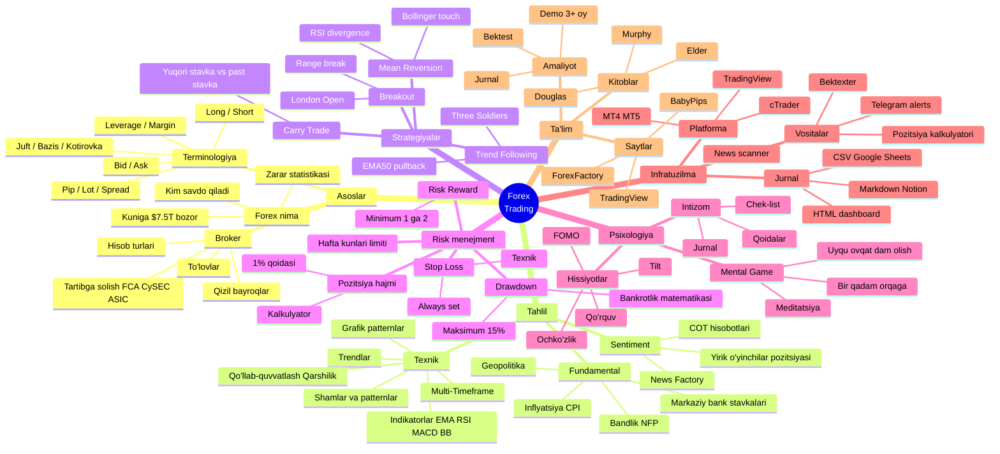

# Loyiha mind map — Forex bitta rasmda

Tushunchalarning to'liq xaritasi. «Miyamdagi mundarija» sifatida foydalanish mumkin.

## Matn tuzilmasi

```
                         FOREX TRADING
                              │
        ┌─────────────────────┼─────────────────────┐
        │                     │                     │
    ASOSLAR             TAHLIL               IJRO
        │                     │                     │
  ┌─────┼─────┐         ┌─────┼─────┐         ┌─────┼─────┐
  │     │     │         │     │     │         │     │     │
Forex Termi- Broker  Tex.  Fund. Sentim.   Stra-  Risk- Psixo-
nima  nolo-         tahlil tahl. tahl.     tegiya menjm. logiya
      giya
```

## Mermaid-diagramma (GitHub / VSCode preview da ko'rinadi)



## Mind mapdan qanday foydalanish

1. **O'zingizning «zaif shoxingizni» toping** — eng yomon tushunadigan narsa
2. **Shu shoxga e'tiboringizni qarating** — kelgusi haftaga
3. **Shoxlar o'rtasida sakramang** — bu amalda rivojlanishsiz rivojlanayotgandek his qildiradi

## Shoxlar bo'yicha ustuvorliklar (yangi boshlovchi uchun)

| Ustuvorlik | Shox | Nima uchun |
|---|---|---|
| 🔴 MUHIM | Risk-menejment | Usiz depozit bir oyda tugaydi |
| 🔴 MUHIM | Psixologiya | Uzoq muddatda asosiy halokat omili |
| 🟡 ZARUR | Asoslar (terminologiya, broker) | Ularsiz savdo qilish mumkin emas |
| 🟡 ZARUR | Tex. tahlil (bazis) | Shamlar, trendlar, EMA, darajalar |
| 🟢 FOYDALI | Strategiyalar | Asoslar o'zlashtirilgandan keyin |
| 🟢 FOYDALI | Infratuzilma | Zarurat bo'lganda |
| 🔵 IXTIYORIY | Fundamental | Bir yillik amaliyotdan keyin |
| 🔵 IXTIYORIY | Ilg'or vositalar | Barqarorlikka erishgandan keyin |

## Shoxlar o'rtasidagi bog'liqliklar

- **Psixologiya ← Risk-menejment**: kichik xavf = sokin psixologiya
- **Strategiya ← Texnik tahlil**: strategiya — bu TA qoidalari to'plami
- **Infratuzilma ← Jurnal**: jurnal qulay bo'lganda yaxshiroq ishlaydi
- **Barcha shoxlar → Intizom**: intizom bo'lmasa hammasi befoyda

---

[← Asosiy qo'llanmaga qaytish](../forex-guide.md)
