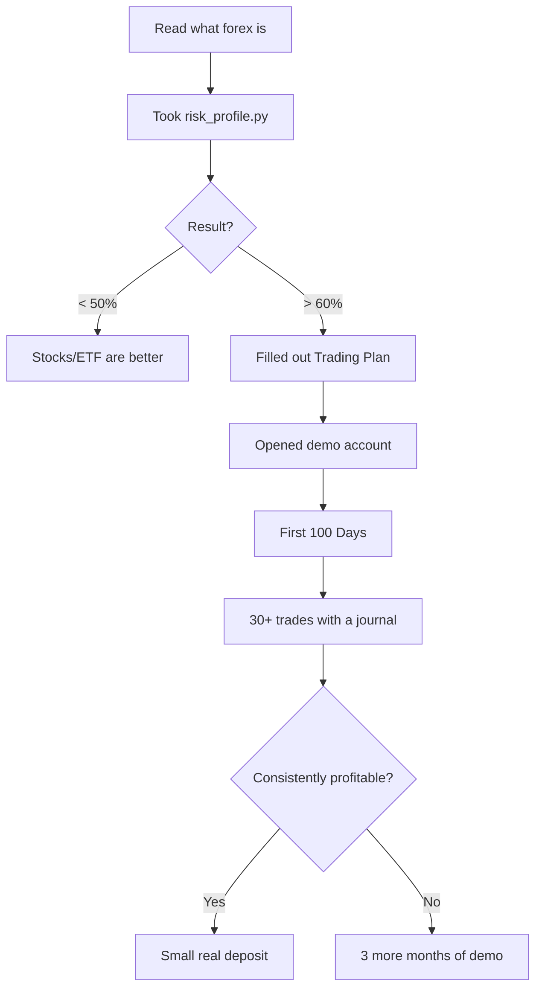

# Forex Trading Toolkit

  
A complete educational project for learning forex from scratch — theory, tools and strategies in one place.

  

    📚 25+ guides
    🛠️ 30+ tools
    🎯 6 strategies
    🧪 95 tests
    🌍 RU · EN · UZ
  

## 📥 Download ready-made materials

-   📕 **PDF handbook** (1.1 MB)

    ---

    The complete handbook in PDF for printing and offline reading.

    [📥 Download PDF](https://github.com/MukhammadAmir-Akbarov/forex-toolkit/releases/latest/download/forex-handbook.pdf){ .md-button .md-button--primary }

-   📄 **Word version** (962 KB)

    ---

    The same handbook in editable `.docx` format.

    [📥 Download DOCX](https://github.com/MukhammadAmir-Akbarov/forex-toolkit/releases/latest/download/forex-guide-rus.docx){ .md-button }

-   🛠️ **Source code**

    ---

    Full repository: Python tools, strategies, tests, bots.

    [⭐ GitHub](https://github.com/MukhammadAmir-Akbarov/forex-toolkit){ .md-button }

!!! warning "⚠️ IMPORTANT DISCLAIMER"
    This document is **educational material**, not financial advice.
    Forex is a high-risk activity. According to ESMA data, **74–89%** of retail
    traders lose money. Never trade with money you cannot afford to lose.

## 🚀 Where to start

1. **[How to use this project](КАК-ПОЛЬЗОВАТЬСЯ.md)** — a tour of the project
2. **[Main handbook](forex-guide.md)** — 700 lines of theory
3. **[Trading psychology](extras/psychology.md)** — the most important skill

## 🎯 Recommended path

## 📊 What's inside

### Guides (RU + EN)
- Main guide (RU 638, EN 638 lines)
- Technical analysis with 20+ charts
- Detailed strategy breakdown
- Glossary of 200+ terms
- 30 FAQ

### Tools
- Calculators (position size, margin, compound interest, pip value)
- Backtester with real data across 8 pairs
- Pattern scanner (8 candlestick patterns)
- Trading Journal CLI + HTML dashboard
- Monte Carlo simulator
- Risk profile test (30 questions)
- Broker license checker

### Bots
- MT5 Expert Advisor (MQL5)
- Telegram signals bot
- Daily Coach bot
- Streamlit web application

### Strategies (with unit tests)
- EMA50 Pullback (trend-following)
- Mean Reversion (Bollinger)
- Breakout (with filters in v2)
- London Open Range
- Three Soldiers / Crows
- Carry Trade (theory)

## 🧪 Code quality

- **74/74** unit tests pass on every push (CI matrix: Ubuntu/macOS × Python 3.10-3.12)
- Tested on **8 currency pairs × 2 years** of real data
- Walk-forward optimization for robustness verification
- Coverage report built in
- **Risk Guardian** (anti-tilt): automatic trading halt after N consecutive losses + daily loss limit
- **Live prices** in the position calculator via yfinance — no stale table values

## 📜 Disclaimer

All materials are educational. The author is not a licensed financial advisor. Trading decisions are yours to make, at your own risk.
