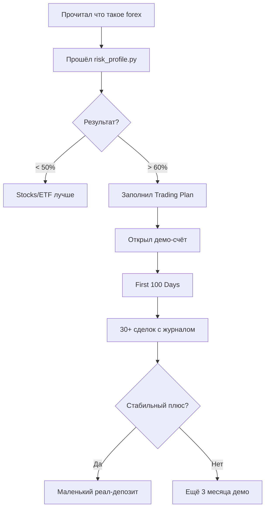

# Forex Trading Toolkit

  📈 <strong>Полный учебный проект для изучения forex с нуля</strong>

  130+ файлов · 25+ учебных гайдов · 30+ Python-инструментов · 6 стратегий · MT5/Telegram/Streamlit боты · 95 unit-тестов · 5 браузерных виджетов

## 📥 Скачать готовые материалы

-   📕 **PDF-учебник** (1.1 MB)

    ---

    Полный учебник в PDF для печати и офлайн-чтения.

    [📥 Скачать PDF](https://github.com/MukhammadAmir-Akbarov/forex-toolkit/releases/latest/download/forex-handbook.pdf){ .md-button .md-button--primary }

-   📄 **Word-версия** (962 KB)

    ---

    Тот же учебник в редактируемом формате `.docx`.

    [📥 Скачать DOCX](https://github.com/MukhammadAmir-Akbarov/forex-toolkit/releases/latest/download/forex-guide-rus.docx){ .md-button }

-   🛠️ **Исходный код**

    ---

    Полный репозиторий: Python-инструменты, стратегии, тесты, боты.

    [⭐ GitHub](https://github.com/MukhammadAmir-Akbarov/forex-toolkit){ .md-button }

!!! warning "⚠️ ВАЖНОЕ ПРЕДУПРЕЖДЕНИЕ"
    Этот документ — **образовательный материал**, не финансовый совет.
    Forex — высокорисковая деятельность. По данным ESMA, **74–89%** розничных
    трейдеров теряют деньги. Никогда не торгуй на деньги, которые не готов потерять.

## 🚀 С чего начать

1. **[Как пользоваться](КАК-ПОЛЬЗОВАТЬСЯ.md)** — экскурсия по проекту
2. **[Главный учебник](forex-guide.md)** — 700 строк теории
3. **[Психология трейдинга](extras/psychology.md)** — главный навык

## 🎯 Рекомендуемый путь

## 📊 Что внутри

### Учебники (RU + EN)
- Главный гайд (RU 638, EN 638 строк)
- Технический анализ с 20+ графиками
- Подробный разбор стратегии
- Глоссарий 200+ терминов
- 30 FAQ

### Инструменты
- Калькуляторы (позиции, маржи, сложного процента, пипса)
- Бэктестер с реальными данными по 8 парам
- Pattern scanner (8 свечных паттернов)
- Trading Journal CLI + HTML dashboard
- Monte Carlo симулятор
- Risk profile тест (30 вопросов)
- Broker license checker

### Боты
- MT5 Expert Advisor (MQL5)
- Telegram signals bot
- Daily Coach bot
- Streamlit веб-приложение

### Стратегии (с unit-тестами)
- EMA50 Pullback (trend-following)
- Mean Reversion (Bollinger)
- Breakout (с фильтрами в v2)
- London Open Range
- Three Soldiers / Crows
- Carry Trade (теория)

## 🧪 Качество кода

- **74/74** unit-теста проходят на каждом push (CI matrix: Ubuntu/macOS × Python 3.10-3.12)
- Тестировано на **8 валютных парах × 2 года** реальных данных
- Walk-forward optimization для проверки робастности
- Coverage отчёт встроен
- **Risk Guardian** (anti-tilt): автоматический стоп торговли после N убытков подряд + дневной лимит потерь
- **Live-цены** в калькуляторе позиции через yfinance — никаких устаревших табличных значений

## 📜 Дисклеймер

Все материалы — образовательные. Автор не лицензированный финансовый советник. Решения о торговле принимаешь ты, под свою ответственность.
