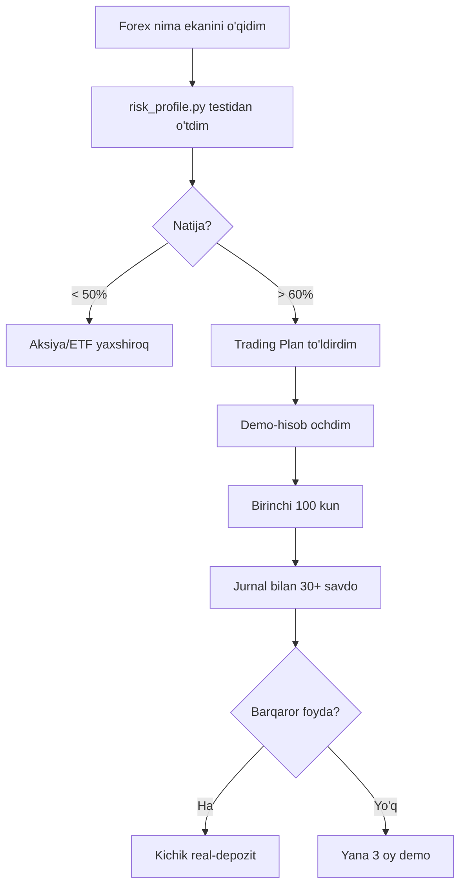

# Forex Trading Toolkit

  📈 <strong>Forexni noldan o'rganish uchun to'liq o'quv loyihasi</strong>

  130+ fayl · 25+ o'quv qo'llanma · 30+ Python-asboblar · 6 strategiya · MT5/Telegram/Streamlit botlar · 74 unit-test

## 📥 Tayyor materiallarni yuklab olish

-   📕 **PDF-darslik** (1.1 MB)

    ---

    Chop etish va oflayn o'qish uchun to'liq darslik PDF formatida.

    [📥 PDF yuklab olish](https://github.com/MukhammadAmir-Akbarov/forex-toolkit/releases/latest/download/forex-handbook.pdf){ .md-button .md-button--primary }

-   📄 **Word-versiyasi** (962 KB)

    ---

    O'sha darslikning tahrirlanadigan `.docx` formatidagi versiyasi.

    [📥 DOCX yuklab olish](https://github.com/MukhammadAmir-Akbarov/forex-toolkit/releases/latest/download/forex-guide-rus.docx){ .md-button }

-   🛠️ **Manba kodi**

    ---

    To'liq repozitoriy: Python-asboblar, strategiyalar, testlar, botlar.

    [⭐ GitHub](https://github.com/MukhammadAmir-Akbarov/forex-toolkit){ .md-button }

!!! warning "⚠️ MUHIM OGOHLANTIRISH"
    Bu hujjat — **o'quv materiali**, moliyaviy maslahat emas.
    Forex — yuqori xavfli faoliyat. ESMA ma'lumotlariga ko'ra, **74–89%**
    chakana treyderlar pul yo'qotadi. Hech qachon yo'qotishga tayyor
    bo'lmagan pulingiz bilan savdo qilmang.

!!! info "🌐 Til haqida"
    Loyihaning asosiy tili — rus tili. O'zbek tilidagi sahifa hozircha
    ushbu bosh sahifagacha tarjima qilingan. Qolgan bo'limlar avtomatik
    ravishda rus tiliga qaytariladi. Tarjimaga yordam berishni xohlaysizmi?
    [GitHub'da PR oching](https://github.com/MukhammadAmir-Akbarov/forex-toolkit/pulls).

## 🚀 Qayerdan boshlash

1. **[Foydalanish qo'llanmasi](КАК-ПОЛЬЗОВАТЬСЯ.md)** — loyiha bo'ylab sayohat
2. **[Asosiy darslik](forex-guide.md)** — 700 qator nazariya
3. **[Treyding psixologiyasi](extras/psychology.md)** — eng muhim ko'nikma

## 🎯 Tavsiya etilgan yo'l

## 📊 Ichida nima bor

### Darsliklar (RU + EN)
- Asosiy qo'llanma (RU 638 qator, EN 638 qator)
- 20+ grafik bilan texnik tahlil
- Strategiyaning batafsil tahlili
- 200+ atamali lug'at
- 30 ta tez-tez beriladigan savol

### Asboblar
- Kalkulyatorlar (lot hajmi, marja, qo'shilgan foiz, pip qiymati)
- 8 ta valyuta jufti uchun real ma'lumotli bektester
- Sham pattern skaneri (8 ta pattern)
- Trading Journal CLI + HTML dashboard
- Monte Carlo simulyatori
- Risk profil testi (30 ta savol)
- Broker litsenziyasini tekshirgich

### Botlar
- MT5 Expert Advisor (MQL5)
- Telegram signal boti
- Daily Coach boti
- Streamlit veb-ilovasi

### Strategiyalar (unit-testlar bilan)
- EMA50 Pullback (trend bo'ylab)
- Mean Reversion (Bollinger)
- Breakout (v2 da filtrlar bilan)
- London Open Range
- Three Soldiers / Crows
- Carry Trade (nazariya)

## 🧪 Kod sifati

- Har bir push da **74/74** unit-test o'tadi (CI: Ubuntu/macOS × Python 3.10-3.12)
- 2 yil davomida **8 valyuta jufti** uchun real ma'lumotlarda sinovdan o'tgan
- Mustahkamlikni tekshirish uchun walk-forward optimization
- Coverage hisobot o'rnatilgan
- **Risk Guardian** (anti-tilt): N marta ketma-ket yo'qotishdan keyin avtomatik to'xtatish + kunlik yo'qotish chegarasi
- Pozitsiya kalkulyatorida yfinance orqali **jonli narxlar** — eskirgan jadval qiymatlari yo'q

## 📜 Mas'uliyatdan ozod qilish

Barcha materiallar o'quv mavzularidir. Muallif litsenziyalangan moliyaviy maslahatchi emas. Savdo qarorlarini o'zingiz, o'z mas'uliyatingiz ostida qabul qilasiz.
