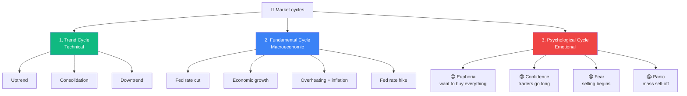
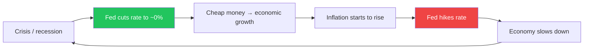
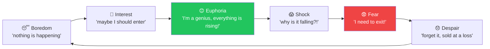

# 🔁 Market cycles — why the market is not «random»

!!! abstract "The core mental model of the market"
    From an experienced trader's practice:

    > **«Forexda sikllarni tushungan treyder vaqtni emas, to'lqinni kutadi.»**
    >
    > *A trader who understands cycles waits not for time, but for the wave.*

    The market is not random. It moves in **cycles**, and understanding those cycles gives a huge advantage over traders who act «on intuition».

---

## 🎯 3 types of cycles



---

## 🔵 1. Trend cycle (technical)

**The most visible cycle — on the chart.**

```
[Uptrend] → [Consolidation / flat] → [Downtrend] → [Consolidation] → ...
```

### What to do in each phase

| Phase | What to do | What NOT to do |
|---|---|---|
| **Uptrend** | BUY on pullbacks to support levels | Open SELL «because it's too high» |
| **Consolidation** | Scalping, small trades at channel boundaries | Open large lots — breakouts are often false |
| **Downtrend** | SELL on pullbacks to resistance levels | Try to catch the bottom «it's already cheap» |

!!! tip "Sign of a phase change"
    A trend **does not reverse instantly**. First, a consolidation forms — a **wide range** on the higher timeframe (H4, D1). Only then comes the reversal.

    If you see «a vertical move in the opposite direction» — that is most likely a **correction within the trend**, not a reversal.

---

## 🟢 2. Fundamental cycle (macroeconomic)

Lasts **years**, but determines the global direction of a pair.

### Example: the Fed rate cycle



**At each phase of the cycle — different assets win:**

| Phase | USD strong? | Gold? | Stocks? | What to trade |
|---|---|---|---|---|
| Rate cut | ❌ Weakens | ✅ Rises | ✅ Rise | Long XAUUSD, Long SPX |
| Low rate | ❌ Weakens | ✅ Rises | ✅ Rise | Long risk assets |
| Rate hike | ✅ Strengthens | ❌ Falls | ❌ Fall | Short XAUUSD, Long USD |
| High rate | ✅ Strong | ❌ Weaker | ⚠️ Sideways | Carry trade, monitor |
| Fed pivot | ❌ Starts weakening | ✅ Starts rising | ✅ Surge | Pivot trades |

!!! info "Current cycle (2025-2026)"
    Check [Markets data sources](../extras/market-data-sources.md) — at the time of reading you need to look at **the latest FOMC decisions** and **CME FedWatch** to understand where we are in the cycle.

---

## 🔴 3. Psychological cycle (emotional)

**The most treacherous.** It acts on hundreds of thousands of traders simultaneously.

### Phases of the emotional cycle



### Where the «crowd» usually buys and where professionals buy

```
😴 Boredom      ← professionals buy here (nobody believes)
🤔 Interest     ← start of the trend
😊 Euphoria     ← the crowd buys here (media shouts "up!")
😱 Shock        ← reversal, crowd holds longs
😨 Fear         ← crowd sells
😞 Despair     ← professionals buy again here
```

!!! danger "The main signal of a psychological cycle shift"
    When **taxi drivers, barbers, relatives** start asking «how to buy bitcoin/gold/dollars» — that is the **cycle top**. The crowd is chasing the trend. In 1-3 months — reversal.

    When **media is full of panic** about «market crash» and all acquaintances are «exiting investments» — that is the **bottom**. In 1-3 months — growth.

---

## 🧠 How to use cycles in trading

### Level 1: look at the higher-timeframe trend

- D1 — what is the global trend?
- H4 — what is the medium-term trend?
- H1 — where do you enter

**Rule:** trade IN THE DIRECTION of the higher-timeframe trend (Trend Cycle).

### Level 2: track the fundamental cycle

- Subscribe to ForexFactory calendar
- Check CME FedWatch weekly
- On FOMC days — close manual positions or hedge them

### Level 3: control your emotions

After a winning streak (5+ wins) — **reduce your lot size**. That is your «euphoria».
After a losing streak (3+ stop-outs) — **reduce your lot even more**. That is your «fear».

Not «confidence justifies a larger lot». A larger lot makes you nervous = more mistakes.

---

## 📊 Seasonal cycles

### «Sell in May and go away»

A well-known stock market pattern:
- **May – October:** low activity, frequent pullbacks
- **November – April:** growth, bullish sentiment

**For gold:** strengthens in winter (defensive sentiment), weakens in summer.

### A practitioner's quote on this:

!!! quote
    *«May oyidan boshlab yozning oxirigacha ko'pincha sentyabr yoki oktyabrga qadar fond bozorlarida sezilarli o'sish bo'lmaydi. Sabablari: yirik investorlar ta'tilga chiqadi, dividend mavsumi tugaydi. Trendoviy uzoq muddatli treyderlar kuni yakunlanib, scalpingchilar mavsumi yaqinlashmoqda (ping-pong).»*

    **Translation:** From May through the end of summer (often through September–October) there is no significant growth on stock markets. Reasons: large investors go on vacation, the dividend season ends. The season for trend traders closes; the scalpers' season (ping-pong) approaches.

---

## ✅ Checklist «Do I know which cycle I'm in?»

Before opening a position, ask yourself:

- [ ] What is the trend on D1? (uptrend / downtrend / sideways)
- [ ] What is the trend on H4? (does it match D1?)
- [ ] What phase of the economic cycle are we in now? (rate hike / rate cut?)
- [ ] Where is the crowd? (euphoria / panic / boredom?)
- [ ] What season is it? (winter/summer, beginning/end of month)
- [ ] Am I trading in the direction of the higher-timeframe trend or against it?

If **3+ questions are unanswered** — close the chart. Read first, then trade.

---

## 🔗 Further reading

- [Technical analysis](../docs/technical-analysis.md) — identifying trends on charts
- [Data sources](../extras/market-data-sources.md) — where to get macroeconomic cycle data
- [Trading psychology](../extras/psychology.md) — how to control the emotional cycle
- [Mind map](../extras/mind-map.md) — the overall map of trader disciplines
