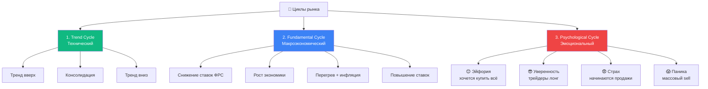
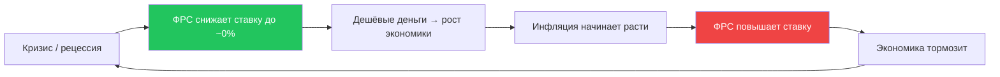
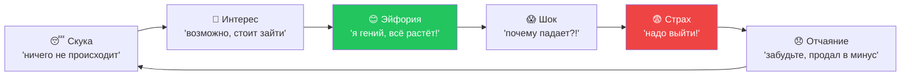

# 🔁 Циклы рынка — почему рынок не «случаен»

!!! abstract "Главная мысленная модель рынка"
    Из практики опытного трейдера:

    > **«Forexda sikllarni tushungan treyder vaqtni emas, to'lqinni kutadi.»**
    >
    > *Трейдер, понимающий циклы — ждёт не времени, а волну.*

    Рынок не случаен. Он движется **циклами**, и понимание этих циклов даёт огромное преимущество перед теми, кто торгует «по интуиции».

---

## 🎯 3 типа циклов



---

## 🔵 1. Тренд-цикл (технический)

**Самый видимый цикл — на графике.**

```
[Tрeнд вверх] → [Консолидация / флэт] → [Tренд вниз] → [Консолидация] → ...
```

### Что делать в каждой фазе

| Фаза | Что делать | Чего НЕ делать |
|---|---|---|
| **Тренд вверх (uptrend)** | BUY на откатах от уровней поддержки | Открывать SELL «потому что слишком высоко» |
| **Консолидация** | Скальпинг, мелкие сделки на границах канала | Открывать большие лоты — пробои часто ложные |
| **Тренд вниз (downtrend)** | SELL на откатах от уровней сопротивления | Ловить дно «уже же дешёво» |

!!! tip "Признак смены фазы"
    Тренд **не разворачивается мгновенно**. Сначала формируется консолидация — **широкий боковик** на старшем таймфрейме (H4, D1). Только потом — разворот.

    Если ты видишь «вертикальное движение в обратную сторону» — это, скорее всего, **коррекция внутри тренда**, а не разворот.

---

## 🟢 2. Фундаментальный цикл (макроэкономический)

Длится **годами**, но определяет глобальное направление пары.

### Пример: цикл ставки ФРС



**На каждой фазе цикла — разные активы выигрывают:**

| Фаза | USD сильный? | Золото? | Акции? | Что торговать |
|---|---|---|---|---|
| Снижение ставки | ❌ Слабеет | ✅ Растёт | ✅ Растут | Long XAUUSD, Long SPX |
| Низкая ставка | ❌ Слабеет | ✅ Растёт | ✅ Растут | Long рисковые активы |
| Рост ставки | ✅ Усиливается | ❌ Падает | ❌ Падают | Short XAUUSD, Long USD |
| Высокая ставка | ✅ Сильный | ❌ Слабее | ⚠️ Боковик | Carry trade, мониторинг |
| Поворот ФРС | ❌ Начинает слабеть | ✅ Начинает расти | ✅ Подскакивают | Поворотные сделки |

!!! info "Текущий цикл (2025-2026)"
    Проверь в [Markets data sources](../extras/market-data-sources.md) — на момент чтения нужно смотреть **последние решения FOMC** и **CME FedWatch**, чтобы понять где мы в цикле.

---

## 🔴 3. Психологический цикл (эмоциональный)

**Самый коварный.** Действует на сотни тысяч трейдеров одновременно.

### Фазы эмоционального цикла



### Где обычно покупает «толпа» и где покупают профи

```
😴 Скука        ← здесь покупают профи (никто не верит)
🤔 Интерес      ← начало тренда
😊 Эйфория      ← здесь покупает толпа (СМИ кричат "вверх!")
😱 Шок          ← разворот, толпа держит лонги
😨 Страх        ← толпа продаёт
😞 Отчаяние    ← здесь снова покупают профи
```

!!! danger "Главный сигнал смены психо-цикла"
    Когда **таксисты, парикмахеры, родственники** начинают спрашивать «как купить биткоин/золото/доллар» — это **топ цикла**. Толпа догоняет тренд. Через 1-3 месяца — разворот.

    Когда **СМИ полны паники** про «крах рынка» и все знакомые «выходят из инвестиций» — это **дно**. Через 1-3 месяца — рост.

---

## 🧠 Как использовать циклы в торговле

### Уровень 1: смотри на тренд старшего таймфрейма

- D1 — какой глобальный тренд?
- H4 — какой среднесрочный тренд?
- H1 — где входишь

**Правило:** торгуй В НАПРАВЛЕНИИ старшего тренда (Trend Cycle).

### Уровень 2: следи за фундаментальным циклом

- Подпишись на ForexFactory calendar
- Смотри CME FedWatch еженедельно
- В дни FOMC — закрывай ручные позиции или защити их

### Уровень 3: контролируй свои эмоции

После прибыльной серии (5+ побед) — **уменьшай лот**. Это твоя «эйфория».
После убыточной серии (3+ стопов) — **уменьшай лот ещё больше**. Это твой «страх».

Не «уверенность даёт большой лот». Бо́льший лот делает тебя нервным = больше ошибок.

---

## 📊 Сезонные циклы

### «Sell in May and go away»

Известный паттерн фондового рынка:
- **Май - Октябрь:** низкая активность, частые откаты
- **Ноябрь - Апрель:** рост, бычий настрой

**Для золота:** усиление зимой (защитные настроения), ослабление летом.

### Цитата практика об этом:

!!! quote
    *«May oyidan boshlab yozning oxirigacha ko'pincha sentyabr yoki oktyabrga qadar fond bozorlarida sezilarli o'sish bo'lmaydi. Sabablari: yirik investorlar ta'tilga chiqadi, dividend mavsumi tugaydi. Trendoviy uzoq muddatli treyderlar kuni yakunlanib, scalpingchilar mavsumi yaqinlashmoqda (ping-pong).»*

    **Перевод:** С мая до конца лета (часто до сентября-октября) на фондовых рынках нет значительного роста. Причины: крупные инвесторы уходят в отпуск, сезон дивидендов заканчивается. Трендовые трейдеры заканчивают, начинается сезон скальперов (ping-pong).

---

## ✅ Чек-лист «Я понимаю в каком я цикле?»

Перед открытием позиции спроси себя:

- [ ] Какой тренд на D1? (uptrend / downtrend / sideways)
- [ ] Какой тренд на H4? (совпадает с D1?)
- [ ] Какая фаза экономического цикла сейчас? (повышение/снижение ставок?)
- [ ] Где находится толпа? (эйфория / паника / скука?)
- [ ] Какой сезон? (зима/лето, начало/конец месяца)
- [ ] Я в направлении старшего тренда или против него?

Если **3+ вопросов без ответа** — закрой график. Сначала почитай, потом торгуй.

---

## 🔗 Что почитать дальше

- [Технический анализ](../docs/technical-analysis.md) — определение трендов на графиках
- [Sources данных](../extras/market-data-sources.md) — где брать данные о макро-цикле
- [Психология трейдинга](../extras/psychology.md) — как контролировать эмоциональный цикл
- [Mind map](../extras/mind-map.md) — общая карта дисциплин трейдера
