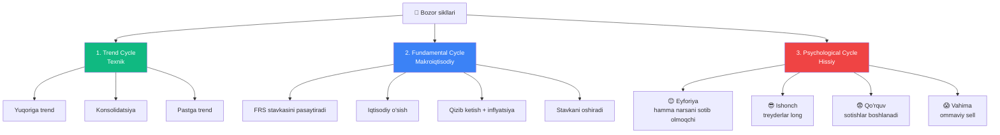
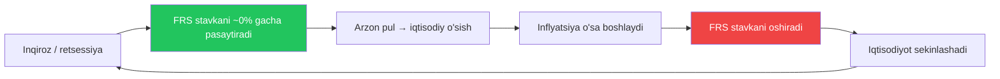
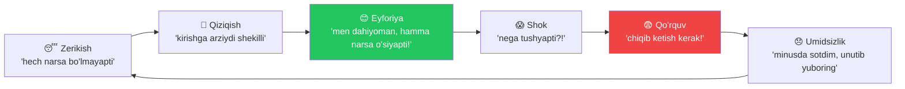

# 🔁 Bozor sikllari — nega bozor «tasodifiy» emas

!!! abstract "Bozorning asosiy aqliy modeli"
    Tajribali treyderning amaliyotidan:

    > **«Forexda sikllarni tushungan treyder vaqtni emas, to'lqinni kutadi.»**
    >
    > *Sikllarni tushunadigan treyder vaqtni emas — to'lqinni kutadi.*

    Bozor tasodifiy emas. U **sikllar** bilan harakat qiladi, va bu sikllarni tushunish — «intuitsiya bilan savdo qiluvchilarga» nisbatan katta ustunlik beradi.

---

## 🎯 3 turdagi sikl



---

## 🔵 1. Trend-sikl (texnik)

**Grafikda eng ko'zga tashlanadigan sikl.**

```
[Yuqoriga trend] → [Konsolidatsiya / flat] → [Pastga trend] → [Konsolidatsiya] → ...
```

### Har bir fazada nima qilish kerak

| Faza | Nima qilish | Nima QILMASLIK |
|---|---|---|
| **Yuqoriga trend (uptrend)** | Qo'llab-quvvatlash darajalaridan orqaga qaytishlarda BUY | «Juda baland bo'lib ketdi» deb SELL ochish |
| **Konsolidatsiya** | Skalping, kanal chegaralarida kichik savdolar | Katta lotlar ochish — ko'pincha soxta yorilib chiqishlar bo'ladi |
| **Pastga trend (downtrend)** | Qarshilik darajalaridan orqaga qaytishlarda SELL | «Allaqachon arzon-ku» deb tubini ushlash |

!!! tip "Faza almashinuvining belgisi"
    Trend **bir lahzada burilmaydi**. Avval konsolidatsiya shakllanadi — katta taymfremda (H4, D1) **keng yon harakat**. Shundan keyingina — burilish.

    Agar «qarama-qarshi tomonga vertikal harakat» ko'rsangiz — bu, ehtimol, **trend ichidagi korreksiya**, burilish emas.

---

## 🟢 2. Fundamental sikl (makroiqtisodiy)

**Yillar** davom etadi, lekin juftlikning global yo'nalishini belgilaydi.

### Misol: FRS stavkasi sikli



**Siklning har bir fazasida — har xil aktivlar yutadi:**

| Faza | USD kuchli? | Oltin? | Aksiyalar? | Nima savdo qilish |
|---|---|---|---|---|
| Stavka pasayishi | ❌ Zaiflashadi | ✅ O'sadi | ✅ O'sadi | Long XAUUSD, Long SPX |
| Past stavka | ❌ Zaiflashadi | ✅ O'sadi | ✅ O'sadi | Long xavfli aktivlar |
| Stavka o'sishi | ✅ Kuchayadi | ❌ Tushadi | ❌ Tushadi | Short XAUUSD, Long USD |
| Yuqori stavka | ✅ Kuchli | ❌ Zaifroq | ⚠️ Yon harakat | Carry trade, monitoring |
| FRS burilishi | ❌ Zaiflashshuvi boshlanadi | ✅ O'sishi boshlanadi | ✅ Sakrab chiqadi | Burilish savdolari |

!!! info "Joriy sikl (2025-2026)"
    [Markets data sources](../extras/market-data-sources.md) da tekshiring — o'qiyotgan paytingizda **FOMC ning so'nggi qarorlariga** va **CME FedWatch** ga qarab siklning qayerida ekanligimizni aniqlash kerak.

---

## 🔴 3. Psixologik sikl (hissiy)

**Eng xavflisi.** Bir vaqtda yuz minglab treyderga ta'sir qiladi.

### Hissiy siklning fazalari



### «Olomon» odatda qayerda sotib oladi va professionalllar qayerda sotib oladi

```
😴 Zerikish       ← bu yerda professionalllar sotib oladi (hech kim ishonmaydi)
🤔 Qiziqish       ← trend boshlanishi
😊 Eyforiya        ← bu yerda olomon sotib oladi (OAV "yuqoriga!" deb qichqiradi)
😱 Shok           ← burilish, olomon longlarni ushlab turibdi
😨 Qo'rquv        ← olomon sotadi
😞 Umidsizlik     ← bu yerda professionalllar yana sotib oladi
```

!!! danger "Psixo-siklning almashinuvining asosiy signali"
    **Taksichilar, sartaroshlar, qarindoshlar** «bitcoin/oltin/dollar qanday sotib olinadi» deb so'rashni boshlaganda — bu **siklning tepasidir**. Olomon trendga yetib kelmoqda. 1-3 oydan keyin — burilish.

    **OAV «bozor qulashi» haqidagi vahimaga to'lib ketganda** va barcha tanishlar «investitsiyalardan chiqib ketayapti» — bu **tub**. 1-3 oydan keyin — o'sish.

---

## 🧠 Savdoda sikllardan qanday foydalanish

### 1-daraja: katta taymfremning trendiga qarang

- D1 — global trend qanday?
- H4 — o'rtacha muddatli trend qanday?
- H1 — kirish joyi qayerda

**Qoida:** katta trend YO'NALISHIDA savdo qiling (Trend Cycle).

### 2-daraja: fundamental siklni kuzating

- ForexFactory kalendariga obuna bo'ling
- CME FedWatch ni har hafta ko'ring
- FOMC kunlarida — qo'lda pozitsiyalarni yoping yoki himoyalang

### 3-daraja: his-tuyg'ularingizni nazorat qiling

Foydali seriyadan keyin (5+ g'alaba) — **lotni kamaytiring**. Bu sizning «eyforiyangiz».
Zarurli seriyadan keyin (3+ stop) — **lotni yanada kamaytiring**. Bu sizning «qo'rquvingiz».

«Ishonch katta lot beradi» emas. Kattaroq lot sizni asabiylashtirishadi = ko'proq xatolar.

---

## 📊 Mavsumiy sikllar

### «Sell in May and go away»

Fond bozorining mashhur naqshi:
- **May - Oktyabr:** past faollik, tez-tez orqaga qaytishlar
- **Noyabr - Aprel:** o'sish, buqalik kayfiyat

**Oltin uchun:** qishda kuchayishi (himoya kayfiyatlari), yozda zaiflashi.

### Bu haqda amaliyotchining iqtibosi:

!!! quote
    *«May oyidan boshlab yozning oxirigacha ko'pincha sentyabr yoki oktyabrga qadar fond bozorlarida sezilarli o'sish bo'lmaydi. Sabablari: yirik investorlar ta'tilga chiqadi, dividend mavsumi tugaydi. Trendoviy uzoq muddatli treyderlar kuni yakunlanib, scalpingchilar mavsumi yaqinlashmoqda (ping-pong).»*

    **Tarjima:** May oyidan yoz oxirigacha (ko'pincha sentyabr-oktyabrgacha) fond bozorlarida sezilarli o'sish bo'lmaydi. Sabablar: yirik investorlar ta'tilga chiqadi, dividend mavsumi tugaydi. Trend treyderlarining davri tugab, skalperlar mavsumi boshlanmoqda (ping-pong).

---

## ✅ «Men qaysi siklda ekanligimni tushunamanmi?» tekshiruv ro'yxati

Pozitsiya ochishdan oldin o'zingizdan so'rang:

- [ ] D1 dagi trend qanday? (uptrend / downtrend / sideways)
- [ ] H4 dagi trend qanday? (D1 bilan mos keladimi?)
- [ ] Hozir iqtisodiy siklning qaysi fazasi? (stavka oshirilmoqdami / pasaytirilmoqdami?)
- [ ] Olomon qayerda? (eyforiya / vahima / zerikish?)
- [ ] Qaysi mavsum? (qish/yoz, oy boshi/oxiri)
- [ ] Men katta trendning yo'nalishidami yoki unga qarshimi?

Agar **3+ savolga javob yo'q** — grafikni yoping. Avval o'qing, keyin savdo qiling.

---

## 🔗 Keyingi nima o'qish kerak

- [Texnik tahlil](../docs/technical-analysis.md) — grafiklarda trendlarni aniqlash
- [Ma'lumotlar manbalari](../extras/market-data-sources.md) — makro-sikl ma'lumotlarini qayerdan olish
- [Treyding psixologiyasi](../extras/psychology.md) — hissiy siklni qanday nazorat qilish
- [Mind map](../extras/mind-map.md) — treyder fanlarining umumiy xaritasi
