# 🥇 Trading gold (XAUUSD) — what you need to know

!!! abstract "Why a dedicated chapter on gold?"
    In Uzbek and Central Asian trading communities **gold (XAUUSD) is pair #1**, not EUR/USD as in Western textbooks.

    From a 2-year archive of a real trader's signals: **~75% of all signals are XAUUSD**. This chapter is therefore focused specifically on gold.

---

## 📊 What is XAUUSD

- **XAU** — the symbol for gold (from Latin *aurum*)
- **USD** — the US dollar
- **XAUUSD** — the price of 1 troy ounce of gold in dollars

**Example:** XAUUSD = 2150.50 means "1 troy ounce of gold costs 2150.50 dollars".

### Contract size at standard brokers (Exness, IC Markets, FxPro):

| Lot | Ounces | Pip Value (at $0.01 tick) |
|---|---|---|
| 0.01 (micro) | 1 | $1 |
| 0.1 (mini) | 10 | $10 |
| 1.0 (standard) | 100 | $100 |

!!! warning "A pip on gold ≠ a pip on forex"
    On EURUSD 1 pip = 0.0001
    On XAUUSD 1 pip = **0.10 (ten cents in price)**

    The spread on gold at most brokers is 2-4 pips, and up to 10-20 pips during news events.

---

## 🧠 Gold's character — not like a forex currency

From the trader's practice:

> *«Тилланинг характери ва ундан фойдаланган ҳолда FULL MARGIN да кириш точкалари берилади.»*
>
> Translation: Gold has its own character, and knowing it you can enter even on full margin.

### What is characteristic of gold (but not EUR/USD):

| Property | EUR/USD | XAUUSD (Gold) |
|---|---|---|
| Daily range | 60-100 pips | **150-500 pips** |
| Reaction to news (NFP, CPI, FOMC) | moderate | **very strong** |
| Geopolitical impact | weak | **strong** (wars, crises) |
| Correlation with DXY (USD index) | direct | **inverse** |
| Active hours (UTC) | 8:00-17:00 | **13:00-22:00** (London+NY) |
| Correlation with equities | low | **inverse** during crises |
| Seasonality | weak | **strong** (stronger in winter/spring) |

---

## 📅 When gold moves the most

### By day of the week

From the channel's 2024 statistics:
- **Monday** — slow start, traps
- **Tuesday-Thursday** — the main moves
- **Friday** — high volatility into the NY close

### By time of day (UTC)

```mermaid
gantt
    title XAUUSD activity throughout the day (UTC)
    dateFormat HH:mm
    axisFormat %H:%M

    section Sessions
    Asia (low activity) :00:00, 08:00
    London (open) :crit, 08:00, 13:00
    London + NY (peak) :crit, 13:00, 17:00
    NY (continuation) :17:00, 22:00
    After NY close :22:00, 24:00
```

**Peak activity:** 13:00-17:00 UTC (when both London and New York are trading simultaneously).

### By news event (what moves gold)

| Event | Impact | When |
|---|---|---|
| **NFP** (Non-Farm Payrolls) | 🔴 Enormous | 1st Friday of the month, 12:30 UTC |
| **CPI** (US inflation) | 🔴 Enormous | ~10th–15th, 12:30 UTC |
| **FOMC** (Fed meeting) | 🔴 Enormous | 8 times a year, 18:00 UTC |
| **Powell speech** | 🔴 Enormous | as scheduled |
| **GDP** (US GDP) | 🟠 Strong | quarterly, 12:30 UTC |
| **PPI** (US PPI) | 🟡 Moderate | ~12th–15th |
| **Core PCE** | 🟡 Moderate | ~25th–30th |
| **ADP** (employment) | 🟢 Weak | the day before NFP |

!!! warning "The golden news rule"
    **30 minutes before** and **30 minutes after** red news events (NFP, CPI, FOMC) — **do NOT open positions manually**. The spread can widen 10x, price will make a sharp spike and reverse, stopping out every position.

---

## ⚙️ How to set SL/TP on gold

From channel practice, **typical sizes**:

| Trade type | Stop Loss | Take Profit | Lot for a $100 balance |
|---|---|---|---|
| **Scalping** (within M5-M15) | 15-25 pips | 25-50 pips | 0.01 |
| **Intraday** (H1) | 30-50 pips | 50-100 pips | 0.01 |
| **Swing** (H4-D1) | 100-200 pips | 200-500 pips | 0.01 |

!!! warning "You cannot use small stops on gold the way you do on forex"
    A 5-10 pip stop on gold is a **guaranteed** stop-out on news or even ordinary market noise. Minimum 20-25 pips.

---

## 🎯 A basic strategy for beginners on gold

**Principles (derived from practice):**

1. **Do not trade against the trend** on the higher timeframe (H4)
2. **Wait for confirmation** — do not enter just because you "see a nice pattern"
3. **Stop always above/below the last significant swing high/low**, not a round number
4. **Risk-Reward minimum 1:1.5**, ideally 1:2
5. **Close half at TP1**, the second TP is a "free" position
6. **Move SL to BE (breakeven)** — after the trade moves in your favour by 30+ pips

📘 Detailed protocol: [Breakeven (move to BE)](breakeven-protocol.md) | [Scaling in](scaling-in.md)

---

## ⚠️ The biggest beginner mistakes on gold

1. **"Big lot = fast profits"** — no, it means fast deposit loss (see [LOT discipline](lot-discipline.md))
2. **Trading through news manually** — the stop will be hit, the limit won't fill cleanly
3. **Ignoring DXY** — when the dollar index rises, gold usually falls (inverse correlation)
4. **"Catching the bottom"** — gold can fall for 3-5 days in a row. Don't catch a falling knife
5. **Closing in the red on emotion** — the stop is already in place, let it do its job
6. **"I know where it's going"** — nobody knows. Work by the rules, not predictions

---

## 📡 What to monitor when trading gold

- **DXY** (US Dollar Index) — inverse correlation, always check it
- **US 10Y Treasury yields** — inverse relationship with gold
- **ForexFactory calendar** — all red USD news events
- **CME FedWatch** — market expectations for the Fed rate
- **Geopolitics** — Middle East, Taiwan, Ukraine — gold is the "safe-haven asset"

More detail: [Data and signal sources](../extras/market-data-sources.md)

---

## 📚 What to read next

- [Position calculator](../tools/position-calculator.md) — calculate the right lot for your deposit on XAUUSD
- [LOT discipline](lot-discipline.md) — the core risk principle
- [Market cycles](cycle-theory.md) — why gold moves in cycles
- [Breakeven / Move to BE](breakeven-protocol.md) — when and how to protect a position
- [Scaling in](scaling-in.md) — when to scale a position

---

!!! info "Source of observations"
    This chapter was compiled from an analysis of a 2-year signal history and commentary by an experienced Uzbek trader. Specific entry points are not provided — this is a methodology, not "copy my approach".
