# 🥇 Торговля золотом (XAUUSD) — что нужно знать

!!! abstract "Почему отдельная глава про золото?"
    В узбекских и центральноазиатских торговых сообществах **золото (XAUUSD) — пара №1**, а не EUR/USD из западных учебников.

    Из проанализированных 2-летних архивов реального трейдера: **~75% всех сигналов — это XAUUSD**. Поэтому здесь — конкретика именно по золоту.

---

## 📊 Что такое XAUUSD

- **XAU** — символ золота (от лат. *aurum*)
- **USD** — доллар США
- **XAUUSD** — стоимость 1 унции золота в долларах

**Пример:** XAUUSD = 2150.50 означает «1 унция золота стоит 2150.50 долларов».

### Размер контракта на стандартных брокерах (Exness, IC Markets, FxPro):

| Лот | Унций | Pip Value (на тике $0.01) |
|---|---|---|
| 0.01 (микро) | 1 | $1 |
| 0.1 (мини) | 10 | $10 |
| 1.0 (стандарт) | 100 | $100 |

!!! warning "Pip на золоте ≠ pip на форекс"
    На EURUSD 1 пипс = 0.0001
    На XAUUSD 1 пипс = **0.10 (десять центов в цене)**

    Спред у большинства брокеров на золоте 2-4 пипса, в новости — до 10-20 пипсов.

---

## 🧠 Характер золота — не как форекс-валюта

Из практики трейдера:

> *«Тилланинг характери ва ундан фойдаланган ҳолда FULL MARGIN да кириш точкалари берилади.»*
>
> Перевод: У золота свой характер, и зная его, можно входить даже на полное плечо.

### Что характерно для золота (но не для EUR/USD):

| Свойство | EUR/USD | XAUUSD (Gold) |
|---|---|---|
| Дневной диапазон | 60-100 пипсов | **150-500 пипсов** |
| Реакция на новости (NFP, CPI, FOMC) | средняя | **очень сильная** |
| Влияние геополитики | слабое | **сильное** (войны, кризисы) |
| Связь с DXY (индекс USD) | прямая | **обратная** |
| Сильные часы (UTC) | 8:00-17:00 | **13:00-22:00** (Лондон+NY) |
| Корреляция с акциями | низкая | **обратная** в кризисы |
| Сезонность | слабая | **сильная** (сильнее зимой/весной) |

---

## 📅 Когда золото движется сильнее всего

### По дням недели

Из статистики канала за 2024:
- **Понедельник** — медленное начало, ловушки
- **Вторник-Четверг** — основные движения
- **Пятница** — высокая волатильность к закрытию NY

### По времени суток (UTC)

```mermaid
gantt
    title Активность XAUUSD в течение дня (UTC)
    dateFormat HH:mm
    axisFormat %H:%M

    section Сессии
    Азия (низкая активность) :00:00, 08:00
    Лондон (старт) :crit, 08:00, 13:00
    Лондон + NY (пик) :crit, 13:00, 17:00
    NY (продолжение) :17:00, 22:00
    После закрытия NY :22:00, 24:00
```

**Пиковая активность:** 13:00-17:00 UTC (когда работают и Лондон, и Нью-Йорк одновременно).

### По новостям (что двигает золото)

| Новость | Влияние | Когда |
|---|---|---|
| **NFP** (Non-Farm Payrolls) | 🔴 Огромное | 1-я пятница месяца, 12:30 UTC |
| **CPI** (инфляция США) | 🔴 Огромное | ~10-15 число, 12:30 UTC |
| **FOMC** (заседание ФРС) | 🔴 Огромное | 8 раз в год, 18:00 UTC |
| **Powell speech** | 🔴 Огромное | по расписанию |
| **GDP** (ВВП США) | 🟠 Сильное | квартально, 12:30 UTC |
| **PPI** (PPI США) | 🟡 Среднее | ~12-15 число |
| **Core PCE** | 🟡 Среднее | ~25-30 число |
| **ADP** (занятость) | 🟢 Слабое | за день до NFP |

!!! warning "Правило золотых новостей"
    За **30 минут до** и **30 минут после** красных новостей (NFP, CPI, FOMC) — **НЕ ОТКРЫВАЙ позиции вручную**. Спред может вырасти в 10x, цена сделает резкое движение и вернётся, выбив все стопы.

---

## ⚙️ Как ставить SL/TP на золоте

Из практики канала, **типичные размеры**:

| Тип сделки | Stop Loss | Take Profit | Лот для $100 баланса |
|---|---|---|---|
| **Скальпинг** (внутри M5-M15) | 15-25 пипсов | 25-50 пипсов | 0.01 |
| **Внутридневная** (H1) | 30-50 пипсов | 50-100 пипсов | 0.01 |
| **Свинг** (H4-D1) | 100-200 пипсов | 200-500 пипсов | 0.01 |

!!! warning "На золоте нельзя ставить мелкие стопы как на форекс"
    Стоп 5-10 пипсов на золоте = **гарантированный** вынос на новостях или просто на «шуме». Минимум 20-25 пипсов.

---

## 🎯 Базовая стратегия для новичка на золоте

**Принципы (выведено из практики):**

1. **Не торгуй против тренда** на старшем таймфрейме (H4)
2. **Жди подтверждения** — не входи на «вижу красивый паттерн»
3. **Стоп всегда выше/ниже последнего значимого экстремума**, не «круглое число»
4. **Risk-Reward минимум 1:1.5**, лучше 1:2
5. **Закрывай половину на 1-м TP**, второй TP — «бесплатная» позиция
6. **Перенос SL в БУ (сейф)** — после движения в плюс на 30+ пипсов

📘 Подробный протокол: [Сейф (move to BE)](breakeven-protocol.md) | [Доливка](scaling-in.md)

---

## ⚠️ Главные ошибки новичков на золоте

1. **«Большой лот = быстрая прибыль»** — нет, это быстрая потеря депозита (см. [ЛОТ-дисциплина](lot-discipline.md))
2. **Торговля во время новостей вручную** — стоп вынесет, лимит не сработает
3. **Игнорирование DXY** — если индекс доллара растёт, золото обычно падает (обратная корреляция)
4. **«Поймать дно»** — золото может падать 3-5 дней подряд. Не лови нож
5. **Закрытие в минусе по эмоциям** — стоп уже стоит, дай ему отработать
6. **«Я знаю куда пойдёт»** — никто не знает. Работай по правилам, а не по предсказаниям

---

## 📡 Что мониторить если торгуешь золото

- **DXY** (US Dollar Index) — обратная корреляция, всегда смотри
- **US 10Y Treasury yields** (доходность 10-летних облигаций) — обратная связь с золотом
- **ForexFactory calendar** — все красные новости по USD
- **CME FedWatch** — рыночные ожидания по ставке ФРС
- **Геополитика** — Ближний Восток, Тайвань, Украина — золото это «защитный актив»

Подробнее: [Источники данных и сигналов](../extras/market-data-sources.md)

---

## 📚 Что почитать дальше

- [Калькулятор позиции](../tools/position-calculator.md) — посчитай лот для своего депозита на XAUUSD
- [ЛОТ-дисциплина](lot-discipline.md) — главный принцип риска
- [Циклы рынка](cycle-theory.md) — почему золото движется циклами
- [Сейф / Перенос в БУ](breakeven-protocol.md) — когда и как защитить позицию
- [Доливка](scaling-in.md) — когда масштабировать позицию

---

!!! info "Источник наблюдений"
    Глава составлена на основе анализа 2-летней истории сигналов и комментариев опытного узбекского трейдера. Конкретные точки входа не приводятся — это методология, а не «скопируй мой подход».
