# 🥇 Oltin savdosi (XAUUSD) — bilish kerak bo'lgan narsalar

!!! abstract "Nega oltin uchun alohida bob?"
    O'zbek va Markaziy Osiyo savdo hamjamiyatlarida **oltin (XAUUSD) — 1-juftlik**, g'arbiy darsliklar kabi EUR/USD emas.

    Tajribali treyderning 2 yillik real arxivini tahlil qilish natijasi: **barcha signallarning ~75% — XAUUSD**. Shuning uchun bu yerda — aynan oltin bo'yicha aniq ma'lumotlar.

---

## 📊 XAUUSD nima

- **XAU** — oltin belgisi (lot. *aurum* dan)
- **USD** — AQSh dollari
- **XAUUSD** — 1 untsiya oltinning dollar narxi

**Misol:** XAUUSD = 2150.50 degani — «1 untsiya oltin 2150.50 dollarga teng».

### Standart brokerlardagi (Exness, IC Markets, FxPro) kontrak hajmi:

| Lot | Untsiya | Pip Value (0.01 $ tikda) |
|---|---|---|
| 0.01 (mikro) | 1 | $1 |
| 0.1 (mini) | 10 | $10 |
| 1.0 (standart) | 100 | $100 |

!!! warning "Oltindagi pip ≠ forexdagi pip"
    EURUSD da 1 pip = 0.0001
    XAUUSD da 1 pip = **0.10 (narxda o'n sent)**

    Ko'pchilik brokerlarda oltindagi spred 2-4 pip, yangiliklar vaqtida — 10-20 pipgacha.

---

## 🧠 Oltinning xarakteri — forex valyutasidan farqli

Treyderning amaliyotidan:

> *«Tилланинг характери ва ундан фойдаланган ҳолда FULL MARGIN да кириш точкалари берилади.»*
>
> Tarjima: Oltinning o'z xarakteri bor va uni bilib, to'liq marginda ham kirish mumkin.

### Oltinga xos xususiyatlar (EUR/USD da yo'q):

| Xususiyat | EUR/USD | XAUUSD (Oltin) |
|---|---|---|
| Kunlik diapazon | 60-100 pip | **150-500 pip** |
| Yangiliklarga reaksiya (NFP, CPI, FOMC) | o'rtacha | **juda kuchli** |
| Geopolitikaga ta'siri | zaif | **kuchli** (urushlar, inqirozlar) |
| DXY (USD indeksi) bilan aloqa | to'g'ri | **teskari** |
| Kuchli soatlar (UTC) | 8:00-17:00 | **13:00-22:00** (London+NY) |
| Aksiyalar bilan korrelyatsiya | past | inqirozlarda **teskari** |
| Mavsumiyligi | zaif | **kuchli** (qish/bahorda kuchliroq) |

---

## 📅 Oltin qachon ko'proq harakat qiladi

### Hafta kunlari bo'yicha

2024 yil kanal statistikasidan:
- **Dushanba** — sekin boshlanish, tuzoqlar
- **Seshanba-Payshanba** — asosiy harakatlar
- **Juma** — NY yopilishiga qarab yuqori volatillik

### Sutkaning vaqti bo'yicha (UTC)

```mermaid
gantt
    title XAUUSD kunlik faolligi (UTC)
    dateFormat HH:mm
    axisFormat %H:%M

    section Sessiyalar
    Osiyo (past faollik) :00:00, 08:00
    London (boshlanish) :crit, 08:00, 13:00
    London + NY (cho'qqi) :crit, 13:00, 17:00
    NY (davom) :17:00, 22:00
    NY yopilgandan keyin :22:00, 24:00
```

**Eng yuqori faollik:** 13:00-17:00 UTC (London va Nyu-York bir vaqtda ishlayotganda).

### Yangiliklar bo'yicha (oltinni nima harakatlantiradi)

| Yangilik | Ta'sir | Qachon |
|---|---|---|
| **NFP** (Non-Farm Payrolls) | 🔴 Ulkan | Oyning 1-juma, 12:30 UTC |
| **CPI** (AQSh inflyatsiyasi) | 🔴 Ulkan | ~10-15-sana, 12:30 UTC |
| **FOMC** (Fed majlisi) | 🔴 Ulkan | Yiliga 8 marta, 18:00 UTC |
| **Powell speech** | 🔴 Ulkan | jadvalga ko'ra |
| **GDP** (AQSh YaIM) | 🟠 Kuchli | choraklik, 12:30 UTC |
| **PPI** (AQSh PPI) | 🟡 O'rtacha | ~12-15-sana |
| **Core PCE** | 🟡 O'rtacha | ~25-30-sana |
| **ADP** (bandlik) | 🟢 Zaif | NFP dan bir kun oldin |

!!! warning "Oltin yangiliklari qoidasi"
    Qizil yangiliklar (NFP, CPI, FOMC) **30 daqiqa oldin** va **30 daqiqa keyin** — **qo'lda pozitsiya ochma**. Spred 10x gacha o'sishi mumkin, narx keskin harakat qilib qaytadi va barcha stopllarni uradi.

---

## ⚙️ Oltinda SL/TP qanday qo'yiladi

Kanal amaliyotidan, **odatdagi o'lchamlar**:

| Savdo turi | Stop Loss | Take Profit | $100 balans uchun lot |
|---|---|---|---|
| **Skalping** (M5-M15 ichida) | 15-25 pip | 25-50 pip | 0.01 |
| **Kunlik** (H1) | 30-50 pip | 50-100 pip | 0.01 |
| **Swing** (H4-D1) | 100-200 pip | 200-500 pip | 0.01 |

!!! warning "Oltinda forexdagi kabi kichik stoplar qo'yib bo'lmaydi"
    Oltinda 5-10 pip stop = yangiliklar yoki shunchaki «shovqin» da **kafolatlangan** chiqarish. Minimum 20-25 pip.

---

## 🎯 Yangi boshlovchi uchun oltindagi asosiy strategiya

**Tamoyillar (amaliyotdan chiqarilgan):**

1. **Katta taymfremdagi (H4) trendga qarshi savdo qilma**
2. **Tasdiqlashni kut** — «chiroyli pattern ko'ryapman» da kirma
3. **Stop har doim oxirgi muhim ekstremumdан yuqorida/pastda**, «yumaloq son» emas
4. **Risk-Reward minimum 1:1.5**, yaxshisi 1:2
5. **Yarmini 1-TP da yop**, ikkinchi TP — «bepul» pozitsiya
6. **SL ni BU (seyf) ga ko'chirish** — 30+ pip foydaga harakat qilgandan keyin

📘 Batafsil protokol: [Seyf (move to BE)](breakeven-protocol.md) | [Qo'shimcha kirish](scaling-in.md)

---

## ⚠️ Yangi boshlovchilarning oltindagi asosiy xatolari

1. **«Katta lot = tez foyda»** — yo'q, bu tez depozit yo'qotish (qarang [LOT-disciplina](lot-discipline.md))
2. **Yangiliklar vaqtida qo'lda savdo** — stop chiqaradi, limit ishlamaydi
3. **DXY ni e'tiborsiz qoldirish** — dollar indeksi o'ssa, oltin odatda tushadi (teskari korrelyatsiya)
4. **«Tubini ushlash»** — oltin 3-5 kun ketma-ket tushishi mumkin. Pichoqni ushlama
5. **Emosiya bilan minusda yopish** — stop allaqachon turibdi, uni ishlatsin
6. **«Qayerga borishi kerakligini bilaman»** — hech kim bilmaydi. Qoidalar bo'yicha ishlang, prognozlar emas

---

## 📡 Oltin bilan savdo qilsang nima kuzatiladi

- **DXY** (US Dollar Index) — teskari korrelyatsiya, har doim qara
- **US 10Y Treasury yields** (10 yillik obligatsiyalar daromadi) — oltin bilan teskari bog'liqlik
- **ForexFactory calendar** — USD bo'yicha barcha qizil yangiliklar
- **CME FedWatch** — Fed stavkasi bo'yicha bozor kutishlari
- **Geopolitika** — Yaqin Sharq, Tayvan, Ukraina — oltin bu «himoya aktivi»

Batafsil: [Ma'lumot va signal manbalari](../extras/market-data-sources.md)

---

## 📚 Keyingi nima o'qish kerak

- [Pozitsiya kalkulyatori](../tools/position-calculator.md) — XAUUSD uchun o'z depozitingiz bo'yicha lot hisoblang
- [LOT-disciplina](lot-discipline.md) — asosiy risk tamoyili
- [Bozor sikllari](cycle-theory.md) — nega oltin sikllar bilan harakat qiladi
- [Seyf / BU ga ko'chirish](breakeven-protocol.md) — pozitsiyani qachon va qanday himoyalash
- [Qo'shimcha kirish](scaling-in.md) — pozitsiyani qachon kattalashtirish

---

!!! info "Kuzatuvlar manbasi"
    Bob tajribali o'zbek treyderning 2 yillik signal tarixi va sharhlari tahlili asosida tuzilgan. Aniq kirish nuqtalari ko'rsatilmaydi — bu metodologiya, «mening yondashuvimni nusxala» emas.
