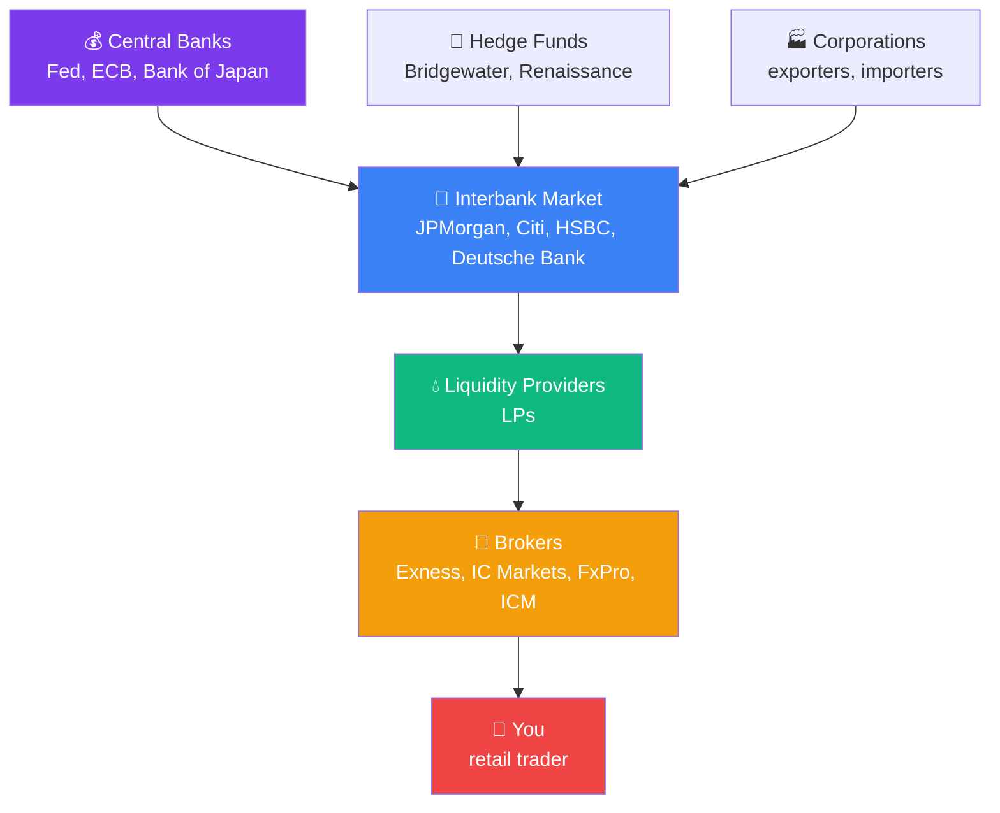
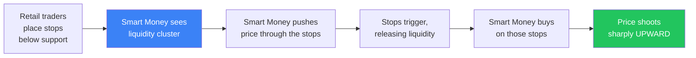

# 🏛️ Forex Market Structure — who actually controls prices

!!! abstract "Why this matters"
    Most beginners think: "I open a position with my broker, the market somehow reacts, the price changes."

    Reality is more complex: you are the **last link** in a chain that starts at the world's largest banks. Understanding that chain explains:

    - Why different brokers show **different prices**
    - Where the **spread** comes from
    - What an **ECN** vs **Market Maker** broker actually is
    - Why **slippage** is unavoidable
    - Why **big moves** start "for no reason" on the chart

---

## 🔗 Diagram: from the Central Bank to you



---

## 1️⃣ Central Banks — the primary "gravitational forces"

They do **not trade every minute**, but their decisions move the entire market:

| Bank | Currency | Main tool |
|---|---|---|
| **Federal Reserve (Fed)** | USD | Federal funds rate, FOMC meetings |
| **European Central Bank (ECB)** | EUR | Refinancing rate, QE |
| **Bank of Japan (BoJ)** | JPY | YCC (Yield Curve Control), interventions |
| **Bank of England (BoE)** | GBP | Rate, inflation targeting |
| **Swiss National Bank (SNB)** | CHF | Direct interventions |
| **People's Bank of China (PBoC)** | CNY | Fixed exchange rate |

!!! warning "When the central bank speaks — the market listens"
    If the Fed announces an unexpected rate change, the price of gold can jump 300+ pips **in 1 second**. **No stop-loss will trigger without slippage.**

    That is why you should **close positions or hedge** in the **30 minutes before and after** FOMC/ECB meetings.

---

## 2️⃣ Interbank — the primary "engine"

Here the largest banks **trade with each other** in real time. Volumes are enormous: **$7+ trillion a day** flows through the forex market.

### Who dominates the interbank (2024-2026 data):

| Bank | Market share | Specialisation |
|---|---|---|
| JPMorgan Chase | ~12% | All majors |
| UBS | ~9% | EUR/CHF, USD pairs |
| Deutsche Bank | ~7% | EUR pairs |
| Citi | ~6% | USD pairs, emerging markets |
| HSBC | ~5% | Asian pairs |
| Goldman Sachs | ~4% | All pairs |
| State Street | ~3% | Custody flows |
| Barclays | ~3% | GBP, EUR |

**These banks set the REAL price** — meaning the rate at which currency actually changes hands in large volume.

### A practitioner's quote on the interbank

!!! quote
    *«Sxemasi shunday: Interbank bozor (banklar) → Likvidlik provayder → Broker → Siz (treyder). Yirik banklar (masalan, JPMorgan, Citi, HSBC) Interbank bozorda o'zaro valyuta savdosi qilib, real narxlarni belgilaydi.»*

    **Translation:** "The scheme is as follows: Interbank market (banks) → Liquidity provider → Broker → You (trader). Large banks (e.g. JPMorgan, Citi, HSBC) trade currencies with each other on the interbank market and set the real prices."

---

## 3️⃣ Liquidity Providers (LP)

These are **intermediaries** between the interbank market and brokers. They receive prices from banks and offer them to brokers.

### The largest LPs:

- **EBS / Reuters** — traditional platforms
- **HotSpot FX** (Cboe) — institutional platform
- **LMAX Exchange** — anonymous matching
- **Currenex** — multi-bank platform
- **Integral** — LP technology infrastructure

LPs aggregate quotes **from multiple banks** and give brokers the **best available price**.

---

## 4️⃣ Brokers — different business models

### A-Book broker (ECN / STP)

```
Your trade → Broker → LP → Interbank
              ↓
     Broker's revenue = SPREAD + commission
```

- The broker **passes your trade on** to the market
- Has no interest in you losing
- More transparent, but **more expensive** (commissions)
- Examples: IC Markets, Pepperstone, ICM Capital

### B-Book broker (Market Maker)

```
Your trade → Broker KEEPS it internally
             (does not pass it to LP)
              ↓
     If you lose — the broker PROFITS
     If you win — the broker LOSES
```

- The broker is the **counterparty to your trade**
- Has a financial interest in your losing
- Cheaper (no commissions), but **conflict of interest**
- Common among some large brokers

### Hybrid (most modern brokers)

Most brokers use a **hybrid model**:
- **Profitable clients** → A-Book (passed to LP)
- **Losing clients** → B-Book (kept internally)

This is **legal**, but it is precisely why you must **be able to make money** — only then will you automatically be moved to the A-Book.

---

## 5️⃣ Where the "whales" live (Smart Money)

**Institutional participants** (banks, hedge funds, central banks) are called "Smart Money."

### How they differ from you:

| Parameter | Smart Money | Retail trader |
|---|---|---|
| Capital | $100M–$10B | $100–$100K |
| News access | Seconds before release (paid feeds) | After public release |
| Spread | Micro (0.0–0.1 pip) | 1–3+ pips |
| Slippage | Minimal | Frequent |
| Analysis | Quant models, AI, proprietary data | TA, public news |
| Trade goal | Distributed execution of large volume | Catching a move |

### The key insight

**Smart Money is NOT personally targeting you.** They work with **liquidity zones** — areas where a large number of retail stop orders accumulate.



**This explains why:**
- Your stop triggered and price reversed within 5 minutes
- You see "wicks" (long candle shadows) on the chart — that is liquidity collection in action
- Big moves often begin "with no obvious news"

---

## 🎯 What this means for you

### 1. Do not place stops at **obvious levels**

Do not place a stop at 1.0800 (a round number) or right below the last low.

**Better:** place it 5–10 pips **deeper** than the level, or after a **confirmed breakout**.

### 2. Do not trade during **low-liquidity periods**

- **Sunday evening UTC** — the market has just opened
- **23:00–02:00 UTC** — between the NY and Tokyo sessions
- **US public holidays** — spread widens, moves are erratic

### 3. Be careful with **B-Book brokers**

If you are unsure about your broker, choose an A-Book / ECN broker. See the list in [Broker comparison](../extras/brokers-comparison.md).

### 4. Understand **smart money flow**

- **POC (Point of Control)** — volume indicators
- **VWAP** — volume-weighted average price
- **Order Flow** — direction of large orders (advanced topic)

More detail: [Order Flow / Volume Profile](../growth/order-flow-volume-profile.md)

---

## ✅ Checklist "Do I understand market structure?"

- [ ] I know that my broker is **not the market itself**, but an intermediary
- [ ] I understand that the **spread is not a broker fee**, but a reflection of real interbank movement
- [ ] I know that trading manually **30 minutes before FOMC** is extremely risky
- [ ] I understand that a **stop at an obvious level** often gets triggered by a Smart Money trap
- [ ] I know that **low liquidity** = high risk (Sundays, overnight, public holidays)

---

## 🔗 What to read next

- [Technical Analysis](../docs/technical-analysis.md) — identifying support and resistance levels
- [Order Flow / Volume Profile](../growth/order-flow-volume-profile.md) — advanced work with Smart Money
- [Broker Comparison](../extras/brokers-comparison.md) — choosing an A-Book / ECN broker
- [Market Cycles](cycle-theory.md) — how macro cycles work
- [Data Sources](../extras/market-data-sources.md) — where to monitor central banks
