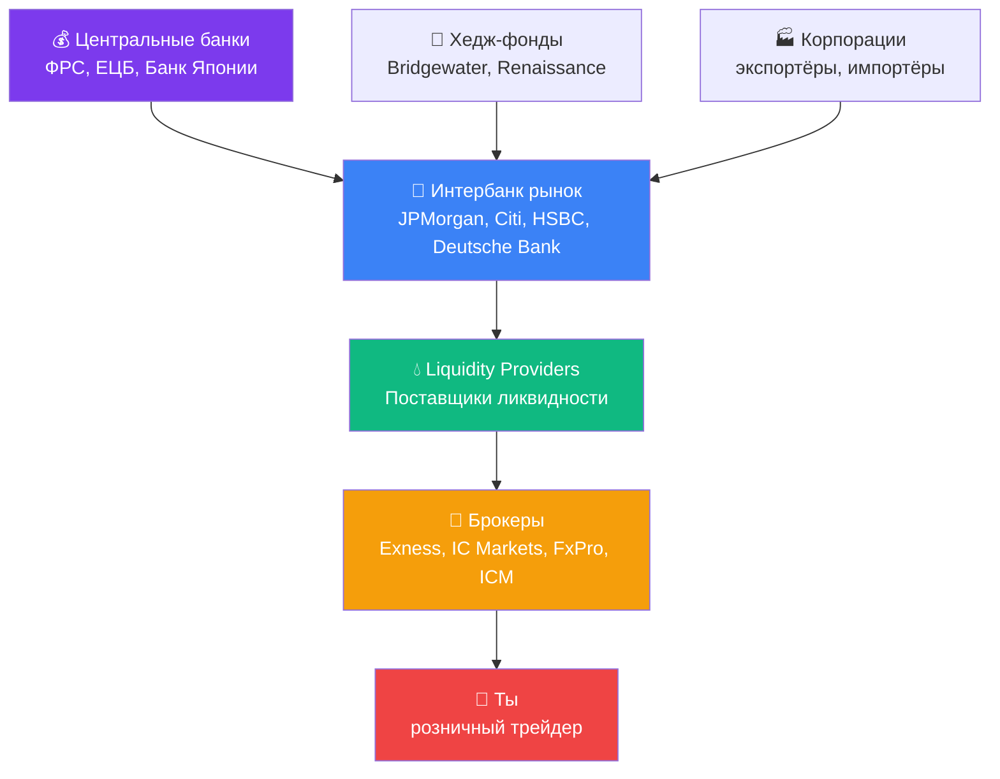

# 🏛️ Структура рынка Forex — кто на самом деле управляет ценами

!!! abstract "Почему важно знать"
    Большинство новичков думает: «Я открываю позицию у брокера, рынок где-то реагирует, цена меняется».

    Реальность сложнее: ты — **последнее звено** в цепочке, которая начинается у крупнейших мировых банков. Понимание этой цепи объясняет:

    - Почему у разных брокеров **разные цены**
    - Откуда берётся **спред**
    - Что такое **ECN** vs **Market Maker** брокер
    - Почему **слиппедж** (проскальзывание) неизбежен
    - Почему **большие движения** начинаются «без причины» на графике

---

## 🔗 Схема: от Центрального банка до тебя



---

## 1️⃣ Центральные банки — главные «гравитанты»

Они **не торгуют каждую минуту**, но их решения двигают весь рынок:

| Банк | Валюта | Главное оружие |
|---|---|---|
| **Federal Reserve (ФРС)** | USD | Ставка по федеральным фондам, FOMC заседания |
| **European Central Bank (ECB)** | EUR | Ставка рефинансирования, QE |
| **Bank of Japan (BoJ)** | JPY | YCC (Yield Curve Control), интервенции |
| **Bank of England (BoE)** | GBP | Ставка, инфляционный таргет |
| **Swiss National Bank (SNB)** | CHF | Прямые интервенции |
| **Народный банк Китая (PBoC)** | CNY | Фиксированный курс |

!!! warning "Когда ЦБ говорит — рынок слушает"
    Если ФРС объявляет неожиданное изменение ставки — **за 1 секунду** цена золота может прыгнуть на 300+ пипсов. **Никакой стоп-лосс не успеет сработать без проскальзывания.**

    Именно поэтому **за 30 минут до и после** заседаний FOMC/ECB **закрывай позиции** или хеджируй.

---

## 2️⃣ Интербанк — главный «двигатель»

Здесь крупнейшие банки **торгуют друг с другом** в режиме реального времени. Объёмы огромны: **$7+ триллионов в день** проходит через форекс.

### Кто доминирует в интербанке (2024-2026 данные):

| Банк | Доля рынка | Специализация |
|---|---|---|
| JPMorgan Chase | ~12% | All majors |
| UBS | ~9% | EUR/CHF, USD pairs |
| Deutsche Bank | ~7% | EUR pairs |
| Citi | ~6% | USD pairs, emerging markets |
| HSBC | ~5% | Asian pairs |
| Goldman Sachs | ~4% | Все пары |
| State Street | ~3% | Custody flows |
| Barclays | ~3% | GBP, EUR |

**Эти банки определяют РЕАЛЬНУЮ цену** — то есть **тот курс, по которому валюта меняется в большом объёме**.

### Цитата практика про интербанк

!!! quote
    *«Sxemasi shunday: Interbank bozor (banklar) → Likvidlik provayder → Broker → Siz (treyder). Yirik banklar (masalan, JPMorgan, Citi, HSBC) Interbank bozorda o'zaro valyuta savdosi qilib, real narxlarni belgilaydi.»*

    **Перевод:** «Схема такова: Интербанк (банки) → Поставщик ликвидности → Брокер → Ты (трейдер). Крупные банки (JPMorgan, Citi, HSBC) на интербанке торгуют валютой друг с другом и устанавливают реальные цены.»

---

## 3️⃣ Liquidity Providers (LP)

Это **посредники** между интербанком и брокерами. Они получают цены от банков и предлагают их брокерам.

### Крупнейшие LP:

- **EBS / Reuters** — традиционные платформы
- **HotSpot FX** (Cboe) — институциональная платформа
- **LMAX Exchange** — anonymous matching
- **Currenex** — мульти-банковская платформа
- **Integral** — технологии для LP

LP агрегируют котировки **из нескольких банков** и дают брокеру **лучшую доступную цену**.

---

## 4️⃣ Брокеры — разные модели работы

### A-Book брокер (ECN / STP)

```
Твоя сделка → Брокер → LP → Интербанк
                ↓
         Заработок брокера = СПРЕД + комиссия
```

- Брокер **передаёт твою сделку** дальше
- Не имеет интереса, чтобы ты проиграл
- Прозрачнее, но **дороже** (комиссии)
- Примеры: IC Markets, Pepperstone, ICM Capital

### B-Book брокер (Market Maker)

```
Твоя сделка → Брокер УДЕРЖИВАЕТ её внутри
              (не передаёт на LP)
                ↓
         Если ты теряешь — брокер ЗАРАБАТЫВАЕТ
         Если ты выигрываешь — брокер ТЕРЯЕТ
```

- Брокер **противоположная сторона сделки**
- Заинтересован в твоём проигрыше
- Дешевле (нет комиссий), но **конфликт интересов**
- Распространено среди некоторых крупных брокеров

### Hybrid (большинство современных)

Большинство брокеров используют **гибридную модель**:
- **Прибыльные клиенты** → A-Book (передают на LP)
- **Убыточные клиенты** → B-Book (держат внутри)

Это **легально**, но именно поэтому ты должен **уметь зарабатывать** — тогда тебя автоматически переключат в A-Book.

---

## 5️⃣ Где живут «киты» (Smart Money)

**Институциональные участники** (banks, hedge funds, central banks) — это «Smart Money», или **умные деньги**.

### Чем они отличаются от тебя?

| Параметр | Smart Money | Розничный трейдер |
|---|---|---|
| Капитал | $100M-$10B | $100-$100K |
| Доступ к новостям | За секунды до публикации (платно) | После публикации |
| Спред | Микро (0.0-0.1 пипса) | 1-3+ пипса |
| Слиппедж | Минимальный | Часто |
| Анализ | Quant модели, AI, инсайды | TA, новости из СМИ |
| Цель сделки | Распределённое исполнение крупного объёма | Поймать движение |

### Главный инсайт

**Smart Money НЕ преследует тебя лично.** Они работают с **зонами ликвидности** — местами, где собирается много стопов розничных трейдеров.


**Это объясняет почему:**
- Твой стоп сработал и через 5 минут цена вернулась
- На графике видны «фитили» (wicks) — это и есть сбор ликвидности
- Большие движения часто начинаются «без явной новости»

---

## 🎯 Что это значит для тебя

### 1. Не ставь стопы на **очевидные уровни**

Не ставь стоп на 1.0800 (круглое число) или прямо под последним low.

**Лучше:** на 5-10 пипсов **глубже** уровня, или после **подтверждённого пробоя**.

### 2. Не торгуй во время **низкой ликвидности**

- **Воскресенье вечер UTC** — рынок только открылся
- **23:00-02:00 UTC** — между сессиями NY и Tokyo
- **Праздники США** — спред расширен, движения хаотичные

### 3. Будь осторожен с **B-Book брокерами**

Если ты не уверен в брокере — выбери A-Book / ECN. Список см. в [сравнении брокеров](../extras/brokers-comparison.md).

### 4. Понимай **smart money flow**

- **POC (Point of Control)** — объёмные индикаторы
- **VWAP** — средневзвешенная по объёму цена
- **Order Flow** — направление крупных ордеров (для продвинутых)

Подробнее: [Order Flow / Volume Profile](../growth/order-flow-volume-profile.md)

---

## ✅ Чек-лист «Я понимаю структуру рынка?»

- [ ] Я знаю, что мой брокер — это **не сам рынок**, а посредник
- [ ] Я понимаю, что **спред — это не плата брокеру**, а отражение реального движения интербанка
- [ ] Я знаю, что **за 30 минут до FOMC** торговать вручную — крайне рискованно
- [ ] Я понимаю, что **стоп под очевидным уровнем** часто срабатывает на ловушке Smart Money
- [ ] Я знаю, что **низкая ликвидность** = высокий риск (воскресенья, ночь, праздники)

---

## 🔗 Что почитать дальше

- [Технический анализ](../docs/technical-analysis.md) — определение уровней поддержки/сопротивления
- [Order Flow / Volume Profile](../growth/order-flow-volume-profile.md) — продвинутая работа со Smart Money
- [Сравнение брокеров](../extras/brokers-comparison.md) — выбор A-Book / ECN брокера
- [Циклы рынка](cycle-theory.md) — как работают макро-циклы
- [Sources данных](../extras/market-data-sources.md) — где следить за центральными банками
