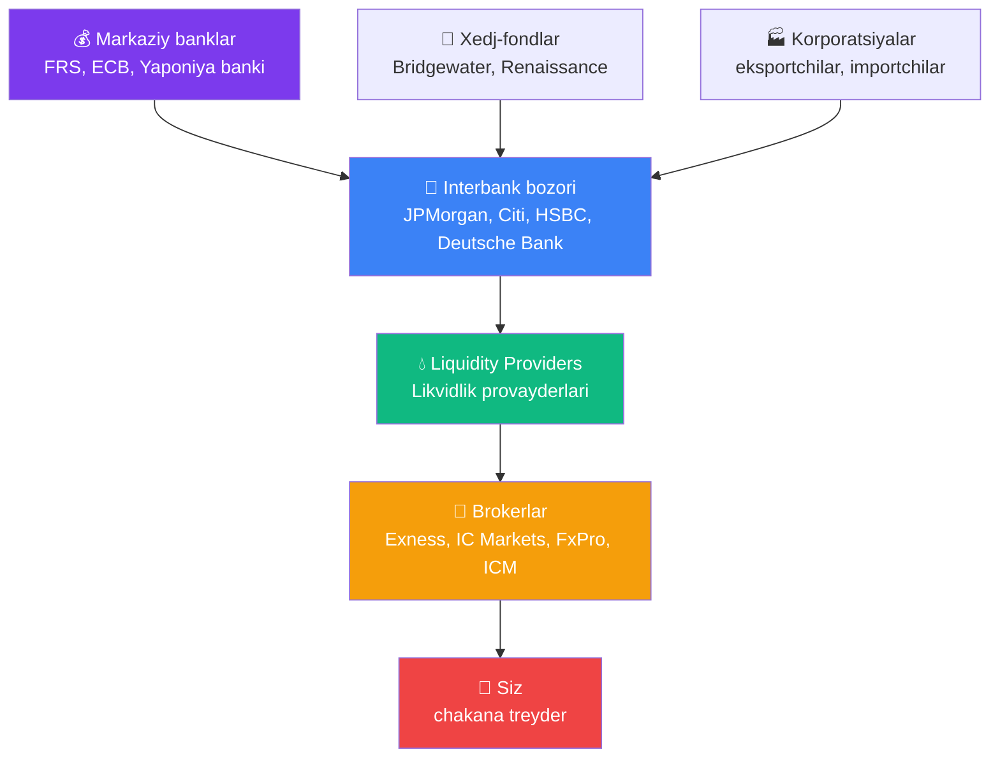
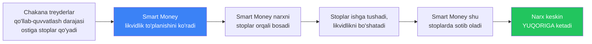

# 🏛️ Forex bozor tuzilmasi — narxlarni kim boshqaradi

!!! abstract "Nima uchun buni bilish muhim"
    Ko'pchilik yangi boshlovchilar shunday o'ylaydi: «Men brokerda pozitsiya ochaman, bozor bir joyda reaksiya beradi, narx o'zgaradi».

    Aslida bu jarayon murakkabroq: siz — dunyoning eng yirik banklaridan boshlanadigan zanjirning **oxirgi bo'g'inisiz**. Bu zanjirni tushunish quyidagilarni tushuntiradi:

    - Nima uchun turli brokerlarda **narxlar har xil**
    - **Spred** qayerdan kelib chiqadi
    - **ECN** va **Market Maker** broker nima farq qiladi
    - Nima uchun **slippage** (sirpanish) muqarrar
    - Nima uchun **katta harakatlar** grafikda «sababsiz» boshlanadi

---

## 🔗 Sxema: Markaziy bankdan sizgacha



---

## 1️⃣ Markaziy banklar — asosiy «tortuvchi kuchlar»

Ular **har daqiqa savdo qilmaydi**, lekin ularning qarorlari butun bozorni harakatlantiradi:

| Bank | Valyuta | Asosiy qurol |
|---|---|---|
| **Federal Reserve (FRS)** | USD | Federal fondlar stavkasi, FOMC majlislari |
| **European Central Bank (ECB)** | EUR | Refinansirlash stavkasi, QE |
| **Bank of Japan (BoJ)** | JPY | YCC (Yield Curve Control), intervensiyalar |
| **Bank of England (BoE)** | GBP | Stavka, inflyatsiya maqsadi |
| **Swiss National Bank (SNB)** | CHF | To'g'ridan-to'g'ri intervensiyalar |
| **Xitoy Xalq banki (PBoC)** | CNY | Belgilangan kurs |

!!! warning "Markaziy bank gaplashganda — bozor eshitadi"
    Agar FRS kutilmagan stavka o'zgarishini e'lon qilsa — **1 soniya ichida** oltin narxi 300+ pip sakrashi mumkin. **Hech qanday stop-loss slippagesiz ishga tushishga ulgurmaydi.**

    Aynan shuning uchun FOMC/ECB majlislaridan **30 daqiqa oldin va keyin** pozitsiyalarni **yoping** yoki xedj qiling.

---

## 2️⃣ Interbank — asosiy «dvigatel»

Bu yerda yirik banklar **bir-biri bilan real vaqt rejimida savdo qiladi**. Hajmlar ulkan: forex orqali **kuniga $7+ trillion** o'tadi.

### Interbankda kim hukmron (2024-2026 ma'lumotlar):

| Bank | Bozor ulushi | Ixtisoslik |
|---|---|---|
| JPMorgan Chase | ~12% | All majors |
| UBS | ~9% | EUR/CHF, USD juftlari |
| Deutsche Bank | ~7% | EUR juftlari |
| Citi | ~6% | USD juftlari, rivojlanayotgan bozorlar |
| HSBC | ~5% | Osiyo juftlari |
| Goldman Sachs | ~4% | Barcha juftlar |
| State Street | ~3% | Custody flows |
| Barclays | ~3% | GBP, EUR |

**Aynan shu banklar REAL narxni belgilaydi** — ya'ni **valyuta katta hajmda almashinadigan kursni**.

### Amaliyotchidan interbank haqida iqtibos

!!! quote
    *«Sxemasi shunday: Interbank bozor (banklar) → Likvidlik provayder → Broker → Siz (treyder). Yirik banklar (masalan, JPMorgan, Citi, HSBC) Interbank bozorda o'zaro valyuta savdosi qilib, real narxlarni belgilaydi.»*

    **Перевод:** «Схема такова: Интербанк (банки) → Поставщик ликвидности → Брокер → Ты (трейдер). Крупные банки (JPMorgan, Citi, HSBC) на интербанке торгуют валютой друг с другом и устанавливают реальные цены.»

---

## 3️⃣ Liquidity Providers (LP)

Bu interbank va brokerlar o'rtasidagi **vositachilar**. Ular banklardan narxlarni oladi va brokerlarga taklif qiladi.

### Yirik LP lar:

- **EBS / Reuters** — an'anaviy platformalar
- **HotSpot FX** (Cboe) — institutsional platforma
- **LMAX Exchange** — anonymous matching
- **Currenex** — ko'p bankli platforma
- **Integral** — LP uchun texnologiyalar

LP lar **bir nechta bankdan** kotirovkalarni agregatsiya qilib, brokerga **mavjud eng yaxshi narxni** beradi.

---

## 4️⃣ Brokerlar — turli ish modellari

### A-Book broker (ECN / STP)

```
Sizning savdoyingiz → Broker → LP → Interbank
                ↓
         Brokerning daromadi = SPRED + komissiya
```

- Broker sizning savdoyingizni **keyinga uzatadi**
- Sizning yutqazishingizdan manfaatdor emas
- Shaffofroq, lekin **qimmatroq** (komissiyalar)
- Misollar: IC Markets, Pepperstone, ICM Capital

### B-Book broker (Market Maker)

```
Sizning savdoyingiz → Broker uni ichida USHLAB QOLADI
              (LP ga uzatmaydi)
                ↓
         Siz yutqazsangiz — broker TOPADI
         Siz yutsangiz — broker YO'QOTADI
```

- Broker — savdoda **qarama-qarshi tomon**
- Sizning yutqazishingizdan manfaatdor
- Arzonroq (komissiyasiz), lekin **manfaatlar to'qnashuvi**
- Ba'zi yirik brokerlarda keng tarqalgan

### Hybrid (ko'pchilik zamonaviy brokerlar)

Ko'pchilik brokerlar **gibrid modeldan** foydalanadi:
- **Foydali mijozlar** → A-Book (LP ga uzatiladi)
- **Zararli mijozlar** → B-Book (ichida ushlab qolinadi)

Bu **qonuniy**, lekin aynan shuning uchun siz **pul ishlashni** bilishingiz kerak — shunda siz avtomatik ravishda A-Book ga o'tkazilasiz.

---

## 5️⃣ «Kitlar» (Smart Money) qayerda yashaydi

**Institutsional ishtirokchilar** (banklar, xedj-fondlar, markaziy banklar) — bu «Smart Money», ya'ni **aqlli pullar**.

### Ular sizdan nimasi bilan farq qiladi?

| Parametr | Smart Money | Chakana treyder |
|---|---|---|
| Kapital | $100M-$10B | $100-$100K |
| Yangiliklarga kirish | Nashrdan bir necha soniya oldin (pullik) | Nashrdan keyin |
| Spred | Mikro (0.0-0.1 pip) | 1-3+ pip |
| Slippage | Minimal | Tez-tez |
| Tahlil | Quant modellari, AI, insaydlar | TA, OAV yangiliklari |
| Savdo maqsadi | Katta hajmni taqsimlangan ijro etish | Harakatni ushlash |

### Asosiy tushuncha

**Smart Money sizni shaxsan ta'qib qilmaydi.** Ular **likvidlik zonalari** bilan ishlaydi — chakana treyderlarning ko'p stoplari to'plangan joylar.



**Bu quyidagilarni tushuntiradi:**
- Stopingiz ishga tushdi va 5 daqiqadan keyin narx qaytdi
- Grafikda «fitillar» (wicks) ko'rinadi — bu likvidlik yig'ish
- Katta harakatlar ko'pincha «aniq sabab ko'rsatmay» boshlanadi

---

## 🎯 Bu siz uchun nima anglatadi

### 1. Stoplarni **ko'zga ko'ringan darajalarga** qo'ymang

Stopni 1.0800 (yumaloq raqam) ga yoki oxirgi low ning aynan ostiga qo'ymang.

**Yaxshisi:** darajadan 5-10 pip **chuqurroqqa** yoki **tasdiqlangan yorilishdan** keyin.

### 2. **Past likvidlik** vaqtida savdo qilmang

- **Yakshanba kechqurun UTC** — bozor endi ochildi
- **23:00-02:00 UTC** — NY va Tokyo sessiyalari o'rtasida
- **AQSh bayrami kunlari** — spred kengaygan, harakatlar xaotik

### 3. **B-Book brokerlar** bilan ehtiyot bo'ling

Brokeringizga ishonchingiz komil bo'lmasa — A-Book / ECN ni tanlang. Ro'yxat uchun [brokerlar taqqoslamasiga](../extras/brokers-comparison.md) qarang.

### 4. **Smart money flow** ni tushuning

- **POC (Point of Control)** — hajmli indikatorlar
- **VWAP** — hajm bo'yicha o'rtacha narx
- **Order Flow** — katta orderlar yo'nalishi (rivojlangan treyderlar uchun)

Batafsil: [Order Flow / Volume Profile](../growth/order-flow-volume-profile.md)

---

## ✅ «Bozor tuzilmasini tushunamanmi?» tekshiruv ro'yxati

- [ ] Mening brokerim — **bozorning o'zi emas**, balki vositachi ekanini bilaman
- [ ] **Spred — brokerga to'lov emas**, balki interbankdagi real harakatning aksi ekanini tushunaman
- [ ] **FOMC dan 30 daqiqa oldin** qo'lda savdo qilish juda xavfli ekanini bilaman
- [ ] **Ko'zga ko'ringan darajadan pastdagi stop** ko'pincha Smart Money tuzoqida ishga tushishini tushunaman
- [ ] **Past likvidlik** = yuqori risk (yakshanbalar, kechasi, bayramlar) ekanini bilaman

---

## 🔗 Keyingi nima o'qish kerak

- [Texnik tahlil](../docs/technical-analysis.md) — qo'llab-quvvatlash/qarshilik darajalarini aniqlash
- [Order Flow / Volume Profile](../growth/order-flow-volume-profile.md) — Smart Money bilan rivojlangan ishlash
- [Brokerlar taqqoslamasi](../extras/brokers-comparison.md) — A-Book / ECN broker tanlash
- [Bozor sikllari](cycle-theory.md) — makro sikllar qanday ishlaydi
- [Ma'lumot manbalari](../extras/market-data-sources.md) — markaziy banklarni qayerda kuzatish
