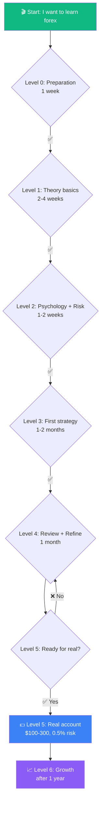
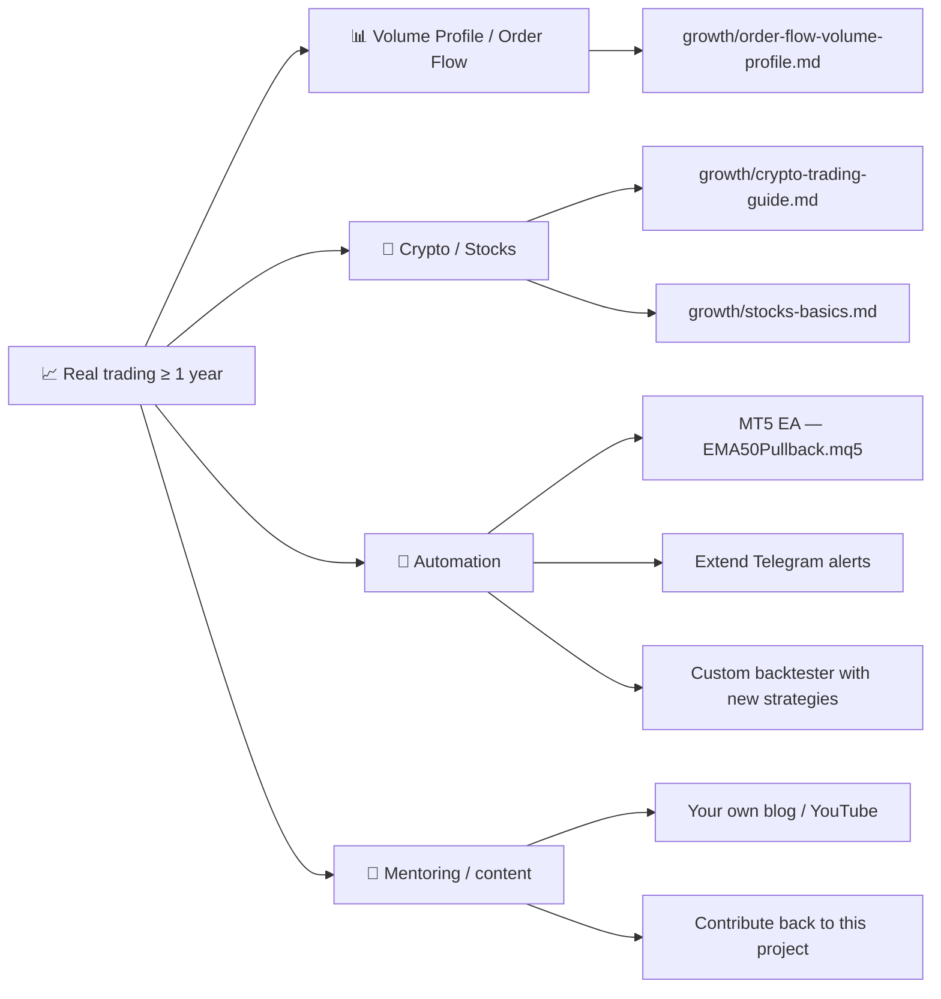

# 🗺️ Learning Roadmap

!!! abstract "How to use this page"
    This is a **step-by-step route** for a beginner who's just starting forex. Each stage has:

    - 🎯 **Goal** — what you should be able to do after
    - ⏱️ **Time** — realistic estimate
    - 📚 **What to read** — specific pages in this project
    - ✅ **Checkpoint** — criteria to move on

    **Don't skip ahead** until you've closed the checkpoints. Otherwise you'll lose money for nothing.

## The big picture

---

## Level 0: Preparation

!!! info "Goal"
    Understand **what forex is**, and check whether it suits you as an activity.

⏱️ **Time**: ~1 week.

### Actions

| Step | Where | Time |
|---|---|---|
| 1. Read "How to use the project" | [Home](index.md) → [How to use](КАК-ПОЛЬЗОВАТЬСЯ.md) | 30 min |
| 2. Understand structure: handbook, tools, strategies | [README](https://github.com/MukhammadAmir-Akbarov/forex-toolkit/blob/main/README.md) | 15 min |
| 3. Take the 30-question readiness test | [Readiness test](tools/risk-profile.md) — right in the browser | 20 min |
| 4. Install Python + dependencies | See [instructions](КАК-ПОЛЬЗОВАТЬСЯ.md) | 30 min |

### ✅ Checkpoint

- [ ] I know what **pip**, **lot**, **spread**, **leverage** mean
- [ ] I understand that **74-89% lose money** in forex
- [ ] The readiness test shows **> 50%**
- [ ] **Python is installed**, `pytest` passes

!!! danger "If test < 50%"
    You should learn about **ETF / index investing** instead, not forex. See [Stocks basics](growth/stocks-basics.md). This isn't judgment — it's math.

---

## Level 1: Theory basics

!!! info "Goal"
    Master the **basic trader vocabulary**: trends, support/resistance, indicators, candle patterns.

⏱️ **Time**: 2-4 weeks (30-60 min/day).

### Actions

| Step | Where | Time |
|---|---|---|
| 1. **Main guide** (full) | [forex-guide.md](forex-guide.md) | ~5 hours |
| 2. Technical analysis with charts | [docs/technical-analysis.md](docs/technical-analysis.md) | ~3 hours |
| 3. Glossary — note unfamiliar terms | [extras/glossary.md](extras/glossary.md) | as you read |
| 4. FAQ — knock out big questions | [extras/faq.md](extras/faq.md) | 1 hour |
| 5. Open a **demo account** at any regulated broker | See [Broker comparison](extras/brokers-comparison.md) | 30 min |
| 6. Get familiar with MT5 / TradingView interface | YouTube + practice | 2-3 hours |

### ✅ Checkpoint

- [ ] I can **explain to someone else** what EMA, RSI, and a trend are
- [ ] I can **show on a chart** support/resistance levels
- [ ] My **demo account** has $1000+ virtual
- [ ] I can **open and close a trade** in the terminal (with correct stop and take)
- [ ] I **don't open trades** without a clear reason

---

## Level 2: Psychology and risk management

!!! info "Goal"
    Realize that **your biggest enemy is yourself**, and learn to manage it.

⏱️ **Time**: 1-2 weeks (read parallel to practice).

### Actions

| Step | Where | Time |
|---|---|---|
| 1. Full **psychology** section | [extras/psychology.md](extras/psychology.md) | ~2 hours |
| 2. **Anti-Tilt protocol** | [extras/anti-tilt-protocol.md](extras/anti-tilt-protocol.md) | 30 min |
| 3. Fill in your **personal trading plan** | [extras/trading-plan-template.md](extras/trading-plan-template.md) | 1 hour |
| 4. Master the **position calculator** | [Calculator](tools/position-calculator.md) | 15 min |
| 5. **Daily routine** for a trader | [extras/daily-routine.md](extras/daily-routine.md) | 30 min |
| 6. **Market data sources** — what to monitor | [extras/market-data-sources.md](extras/market-data-sources.md) | 1 hour |

### ✅ Checkpoint

- [ ] My Trading Plan is **filled out and printed**
- [ ] I know **what to do after 3 losing trades in a row** (anti-tilt protocol)
- [ ] I know **how to use** the position calculator
- [ ] I **never open** a position without calculating risk
- [ ] I have **written my daily routine** (when I read news, when I look at charts)

---

## Level 3: First strategy

!!! info "Goal"
    Master **one strategy thoroughly**, make 30+ demo trades, **keep a journal**.

⏱️ **Time**: 1-2 months. **Don't rush.**

### Actions

| Step | Where | Time |
|---|---|---|
| 1. Study **EMA50 Pullback** in detail | [docs/strategy-details.md](docs/strategy-details.md) | 1 hour |
| 2. Run the **backtester** on synthetic data | `python bot/backtest.py` | 30 min |
| 3. Download **real data** for EUR/USD | `python advanced/data_downloader.py --symbol EURUSD --years 2` | 10 min |
| 4. Backtest with **realistic spread** | `python bot/backtest.py --csv data/EURUSD_1h.csv --spread-pips 2 --max-consecutive-losses 3` | 30 min |
| 5. **Open the trading journal** | `python tools/journal_cli.py --help` | 5 min |
| 6. **30+ demo trades** on the EMA50 strategy | Broker terminal | 1-2 months |
| 7. **Every trade** in the journal with entry reason and emotions | `journal_cli.py add` | 5 min/trade |

### ✅ Checkpoint

- [ ] My journal has **30+ entries** with entry descriptions
- [ ] I can run `journal_dashboard.py` and **read my own stats**
- [ ] Win rate and Profit Factor are **stable** on demo
- [ ] I **didn't break** my Trading Plan in the last 10 trades

---

## Level 4: Review and refine

!!! info "Goal"
    Find **your own mistakes**, understand what works, and tweak the strategy.

⏱️ **Time**: ~1 month.

### Actions

| Step | Where | Time |
|---|---|---|
| 1. **Journal analyzer** for insights | `python tools/journal_analyzer.py` | 30 min |
| 2. **Mistakes log** — list what repeats | [journal/mistakes-log.md](journal/mistakes-log.md) | 1 hour |
| 3. Read **strategy comparison** | `python strategies/compare.py` | 1 hour |
| 4. **Walk-forward optimization** — robustness check | `python advanced/walk_forward.py` | 30 min |
| 5. **Monte Carlo** — risk of ruin | `python tools/monte_carlo.py --winrate 0.5 --rr 2` | 15 min |
| 6. **Another 30 demo trades** with corrections | Terminal | 1 month |

### ✅ Checkpoint

- [ ] I know my **3 biggest mistakes** and wrote them down
- [ ] I **fixed** at least one in new trades
- [ ] Win rate is **stable** (not bouncing 80% → 20% → 70%)
- [ ] **3 months on demo** has passed
- [ ] I'm **psychologically ready** for real losses

---

## Level 5: Going to a real account

!!! info "Goal"
    Move to real money with a **minimum deposit**, without breaking risk rules.

⏱️ **Time**: individual.

### Actions

| Step | Where | Time |
|---|---|---|
| 1. Read **Demo vs Real** | [journal/demo-vs-real-comparison.md](journal/demo-vs-real-comparison.md) | 30 min |
| 2. **Open a real account** for $100-300 | Same broker as your demo | 1-2 days (KYC) |
| 3. Use **micro lots only** (0.01) | Terminal | — |
| 4. **0.5% risk per trade** — no exceptions | Position calculator | every trade |
| 5. **First real trade** logged separately | `journal_cli.py add` | — |
| 6. **30 real trades** with journal | 1-2 months | 5 min/trade |

!!! danger "Main rule for real money"
    **Don't trade money you need** for living, rent, or food.

    Real losses **hit your psyche harder** than demo. That's normal. Accept it.

### ✅ Checkpoint

- [ ] I have **30+ real trades** in the journal
- [ ] I **never exceeded 0.5% risk** on any trade
- [ ] Balance has **not dropped more than 15%**
- [ ] I can **endure drawdowns** without emotional decisions

---

## Level 6: Growth (after a year)

!!! info "Goal"
    Go deeper, expand the toolkit, possibly automate.

⏱️ **Time**: infinite.

### Possible directions

### What NOT to do at this stage

- ❌ Suddenly **bump risk to 5-10%**
- ❌ Subscribe to **paid signals**
- ❌ Drop the journal — it becomes **even more important** to see growth
- ❌ Teach others until **you've shown** stable 2+ year returns

---

## ⚠️ Top rules at every stage

!!! warning "Don't skip"
    1. **Never trade money** you need
    2. **At least 3 months** of demo before real
    3. **Always set a stop-loss**
    4. **Risk ≤ 1%** per trade (beginner 0.5%)
    5. **Keep a journal** of every trade
    6. **Don't believe** easy-money promises
    7. **Analyze losses**, not just wins
    8. **Isolate from "gurus"** — no paid signals

## 📍 Where are you now?

| If you have… | Go to |
|---|---|
| Zero knowledge | [Level 0: Preparation](#level-0-preparation) |
| Demo account, indicators are unclear | [Level 1: Theory basics](#level-1-theory-basics) |
| Theory but losing demo | [Level 2: Psychology](#level-2-psychology-and-risk-management) |
| 10+ demo trades without journal | [Level 3: First strategy](#level-3-first-strategy) |
| 30+ trades, win rate not stable | [Level 4: Review](#level-4-review-and-refine) |
| Stable on demo 3+ months | [Level 5: Real](#level-5-going-to-a-real-account) |
| 1+ year on real | [Level 6: Growth](#level-6-growth-after-a-year) |

---

## ⚠️ Disclaimer

This is an **educational** route. Timeframes are estimates. Everyone learns at their own pace. If you don't feel ready — **don't rush**. Better to spend an extra month on demo than lose your deposit.

**No "roadmap" guarantees profit.** The final outcome depends only on you — your discipline, risk management, and psychology.
