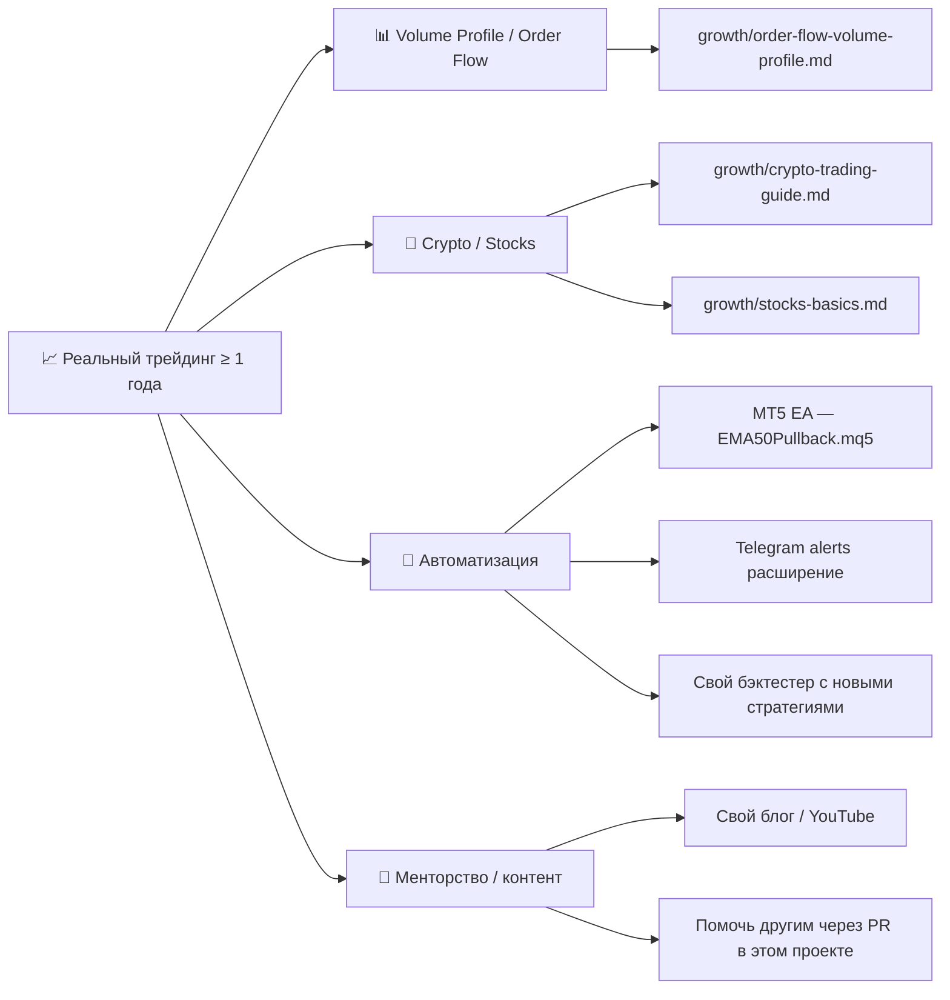

# 🗺️ Дорожная карта обучения

!!! abstract "Как пользоваться этой страницей"
    Это **пошаговый маршрут** для новичка, который только начинает учиться форексу. Каждый этап имеет:

    - 🎯 **Цель** — что должен уметь после этого этапа
    - ⏱️ **Срок** — реалистичная оценка
    - 📚 **Что читать** — конкретные страницы проекта
    - ✅ **Контрольная точка** — критерий, чтобы перейти к следующему этапу

    **Не переходи** к следующему уровню, пока не закрыл контрольные точки. Иначе зря потеряешь деньги.

## Общая картина

  <!-- Старт -->
  

    
🏁

    

      

        
Старт: я хочу научиться форексу

      

      
Первый шаг — пройти путь с нуля до уверенного трейдера на демо.

      

        Новичок
        <a href="../" class="fx-rm__tag">Главная →</a>
      

    

  

  <!-- Фаза 1 -->
  
🌱 Фаза 1 — Основы

  <!-- Уровень 0 -->
  

    
0

    

      

        
Уровень 0: Подготовка

        ~1 неделя
      

      
Понять, что такое форекс, и проверить — подходит ли он тебе.

      

        Пипс · Лот · Спред · Плечо
        <a href="../КАК-ПОЛЬЗОВАТЬСЯ/" class="fx-rm__tag">Как пользоваться →</a>
      

    

  

  <!-- Уровень 1 -->
  

    
1

    

      

        
Уровень 1: Основы теории

        2–4 недели
      

      
Освоить базовый язык трейдера: тренды, поддержка/сопротивление, индикаторы, свечи.

      

        EMA · RSI · S/R
        <a href="../forex-guide/" class="fx-rm__tag">Учебник →</a>
        <a href="../docs/technical-analysis/" class="fx-rm__tag">Техн. анализ →</a>
      

    

  

  <!-- Фаза 2 -->
  
⚡ Фаза 2 — Психология и стратегия

  <!-- Уровень 2 -->
  

    
2

    

      

        
Уровень 2: Психология и риск-менеджмент

        1–2 недели
      

      
Понять, что главный противник — ты сам. Калькулятор позиции, торговый план.

      

        Anti-Tilt · Trading Plan
        <a href="../extras/psychology/" class="fx-rm__tag">Психология →</a>
        <a href="../tools/position-calculator/" class="fx-rm__tag">Калькулятор →</a>
      

    

  

  <!-- Уровень 3 -->
  

    
3

    

      

        
Уровень 3: Первая стратегия

        1–2 месяца
      

      
Выбрать одну стратегию, освоить бэктест и отторговать 50+ сделок на демо.

      

        50+ демо-сделок
        <a href="../docs/strategy-details/" class="fx-rm__tag">Стратегия →</a>
        <a href="../tools/replay-trainer/" class="fx-rm__tag">Replay →</a>
      

    

  

  <!-- Фаза 3 -->
  
🚀 Фаза 3 — Продвинутое

  <!-- Уровень 4 -->
  

    
4

    

      

        
Уровень 4: Анализ и доработка

        ~1 месяц
      

      
Анализировать результаты, вести журнал сделок, исправлять ошибки итерационно.

      

        Winrate > 50% · RR ≥ 1.5
        <a href="../journal/web-journal/" class="fx-rm__tag">Журнал →</a>
        <a href="../tools/winrate-rr-calculator/" class="fx-rm__tag">WinRate × RR →</a>
      

    

  

  <!-- Развилка -->
  

    
?

    

      

        
Уровень 5: Готов к реалу?

      

      
Пройди итоговый экзамен. Если результат ниже порога — возвращайся на уровень 4.

      

        ❌ Нет → уровень 4
        <a href="../tools/exam/" class="fx-rm__tag">🎓 Итоговый экзамен →</a>
        <a href="../tools/quiz/" class="fx-rm__tag">Квиз →</a>
      

    

  

  <!-- Фаза реал -->
  
💵 Реальный счёт

  <!-- Уровень 5 Реал -->
  

    
5

    

      

        
Уровень 5: Реальный счёт

        $100–300
      

      
Открыть реальный счёт с минимальным депозитом. Риск 0.5% в сделку, без исключений.

      

        0.5% риска · Мини-лоты
        <a href="../extras/brokers-comparison/" class="fx-rm__tag">Брокеры →</a>
        <a href="../uz/brokers-uz/" class="fx-rm__tag">Брокеры для УЗ →</a>
      

    

  

  <!-- Уровень 6 -->
  

    
6

    

      

        
Уровень 6: Развитие после года

        После 12 мес.
      

      
Расширять инструментарий: Order Flow, крипто, акции, портфельное мышление.

      

        Доходность > 0
        <a href="../growth/order-flow-volume-profile/" class="fx-rm__tag">Order Flow →</a>
        <a href="../growth/crypto-trading-guide/" class="fx-rm__tag">Крипто →</a>
        <a href="../growth/stocks-basics/" class="fx-rm__tag">Акции →</a>
      

    

  

---

## Уровень 0: Подготовка

!!! info "Цель"
    Понять, **что такое форекс вообще**, и проверить, подходит ли он тебе как занятие.

⏱️ **Срок**: ~1 неделя.

### Что делать

| Шаг | Где это | Время |
|---|---|---|
| 1. Прочитать «Как пользоваться проектом» | [Главная](index.md) → [Как пользоваться](КАК-ПОЛЬЗОВАТЬСЯ.md) | 30 мин |
| 2. Понять структуру: что есть учебник, инструменты, стратегии | [README](https://github.com/MukhammadAmir-Akbarov/forex-toolkit/blob/main/README.md) | 15 мин |
| 3. Пройти 30-вопросный тест готовности | `tools/risk_profile.py` | 20 мин |
| 4. Установить Python и зависимости | См. [инструкцию](КАК-ПОЛЬЗОВАТЬСЯ.md) | 30 мин |

### ✅ Контрольная точка

- [ ] Я знаю, что такое **пипс**, **лот**, **спред**, **плечо**
- [ ] Я понимаю, что **74-89% теряют деньги** на форексе
- [ ] Тест готовности показал **> 50%**
- [ ] У меня **установлен Python**, `pytest` проходит

!!! danger "Если тест < 50%"
    Тебе сейчас стоит изучать **ETF / индексное инвестирование**, не форекс. См. [Stocks basics](growth/stocks-basics.md). Это не упрёк — это математика.

---

## Уровень 1: Основы теории

!!! info "Цель"
    Освоить **базовый язык** трейдера: тренды, поддержка/сопротивление, индикаторы, свечные паттерны.

⏱️ **Срок**: 2-4 недели (по 30-60 мин/день).

### Что делать

| Шаг | Где это | Время |
|---|---|---|
| 1. **Главный учебник** (целиком) | [forex-guide.md](forex-guide.md) | 700 строк, ~5 часов |
| 2. Технический анализ с графиками | [docs/technical-analysis.md](docs/technical-analysis.md) | ~3 часа |
| 3. Глоссарий — выписать незнакомые термины | [extras/glossary.md](extras/glossary.md) | по мере чтения |
| 4. FAQ — снять основные вопросы | [extras/faq.md](extras/faq.md) | 1 час |
| 5. Открыть **демо-счёт** у любого регулируемого брокера | См. [Сравнение брокеров](extras/brokers-comparison.md) и [Брокеры для УЗ](uz/brokers-uz.md) | 30 мин |
| 6. Освоить базовый интерфейс MT5 / TradingView | YouTube + практика | 2-3 часа |

### ✅ Контрольная точка

- [ ] Я могу **объяснить другому человеку** что такое EMA, RSI, тренд
- [ ] Я могу **показать на графике** уровни поддержки/сопротивления
- [ ] У меня **открыт демо-счёт** с виртуальными $1000+
- [ ] Я могу **открыть и закрыть сделку** в терминале (с правильным стопом и тейком)
- [ ] Я **не открываю сделки** без понятной причины

---

## Уровень 2: Психология и риск-менеджмент

!!! info "Цель"
    Понять, что **главный твой противник — ты сам**, и научиться этим управлять.

⏱️ **Срок**: 1-2 недели (читай параллельно с практикой).

### Что делать

| Шаг | Где это | Время |
|---|---|---|
| 1. Полный раздел **психологии** | [extras/psychology.md](extras/psychology.md) | 22 KB, ~2 часа |
| 2. **Anti-Tilt протокол** — что делать при срыве | [extras/anti-tilt-protocol.md](extras/anti-tilt-protocol.md) | 30 мин |
| 3. Заполнить **личный торговый план** | [extras/trading-plan-template.md](extras/trading-plan-template.md) | 1 час |
| 4. Освоить **калькулятор позиции** | [Калькулятор](tools/position-calculator.md) | 15 мин |
| 5. **Daily routine** — режим дня трейдера | [extras/daily-routine.md](extras/daily-routine.md) | 30 мин |
| 6. **Источники данных** — что мониторить | [extras/market-data-sources.md](extras/market-data-sources.md) | 1 час |

### ✅ Контрольная точка

- [ ] У меня **заполнен и распечатан** Trading Plan
- [ ] Я знаю **что делать после 3 проигрышей подряд** (anti-tilt протокол)
- [ ] Я **умею пользоваться** калькулятором позиции
- [ ] Я **никогда не открываю** позицию без расчёта риска
- [ ] Я **записал свой ежедневный режим** (когда читаю новости, когда смотрю графики)

---

## Уровень 3: Первая стратегия

!!! info "Цель"
    Освоить **одну стратегию досконально**, сделать 30+ сделок на демо, **вести журнал**.

⏱️ **Срок**: 1-2 месяца. **Не торопись.**

### Что делать

| Шаг | Где это | Время |
|---|---|---|
| 1. Изучить **EMA50 Pullback** в деталях | [docs/strategy-details.md](docs/strategy-details.md) | 1 час |
| 2. Прогнать **бэктестер** на синтетике | `python bot/backtest.py` | 30 мин |
| 3. Скачать **реальные данные** EUR/USD | `python advanced/data_downloader.py --symbol EURUSD --years 2` | 10 мин |
| 4. Прогнать бэктестер с **реалистичным спредом** | `python bot/backtest.py --csv data/EURUSD_1h.csv --spread-pips 2 --max-consecutive-losses 3` | 30 мин |
| 5. **Открыть журнал сделок** | `python tools/journal_cli.py --help` | 5 мин |
| 6. **30+ сделок на демо** по стратегии EMA50 | Терминал брокера | 1-2 мес |
| 7. **Каждую сделку** — в журнал, с причиной входа и эмоциями | `journal_cli.py add` | 5 мин/сделка |

### ✅ Контрольная точка

- [ ] У меня в журнале **30+ записей** с описанием входов
- [ ] Я могу запустить `journal_dashboard.py` и **прочитать свою статистику**
- [ ] Win rate и Profit Factor стабильны на демо
- [ ] Я **не нарушил** свой Trading Plan ни разу за последние 10 сделок

---

## Уровень 4: Анализ и доработка

!!! info "Цель"
    Найти **свои ошибки**, понять что работает, и подкорректировать стратегию.

⏱️ **Срок**: ~1 месяц.

### Что делать

| Шаг | Где это | Время |
|---|---|---|
| 1. **Анализатор журнала** — AI-инсайты | `python tools/journal_analyzer.py` | 30 мин |
| 2. **Журнал ошибок** — выписать что повторяется | [journal/mistakes-log.md](journal/mistakes-log.md) | 1 час |
| 3. Прочитать **сравнение стратегий** | `python strategies/compare.py` | 1 час |
| 4. **Walk-forward optimization** — проверь робастность | `python advanced/walk_forward.py` | 30 мин |
| 5. **Monte Carlo** — оцени риск разорения | `python tools/monte_carlo.py --winrate 0.5 --rr 2` | 15 мин |
| 6. **Ещё 30 сделок** на демо с корректировками | Терминал | 1 мес |

### ✅ Контрольная точка

- [ ] Я знаю **3 свои главные ошибки** и записал их
- [ ] Я **исправил** хотя бы одну из них в новых сделках
- [ ] Win rate **стабилен** (не прыгает 80% → 20% → 70%)
- [ ] **3 месяца на демо** уже прошло
- [ ] Я **психологически готов** к реальным потерям

---

## Уровень 5: Переход на реальный счёт

!!! info "Цель"
    Перейти на реальные деньги **с минимальным депозитом**, не нарушая риск-правил.

⏱️ **Срок**: индивидуально.

### Что делать

| Шаг | Где это | Время |
|---|---|---|
| 1. Прочитать **Demo vs Real** | [journal/demo-vs-real-comparison.md](journal/demo-vs-real-comparison.md) | 30 мин |
| 2. **Открыть реальный счёт** на $100-300 | У того же брокера, что демо | 1-2 дня (верификация) |
| 3. Использовать **только микро-лоты** (0.01) | Терминал | — |
| 4. **Риск 0.5%** на сделку — без исключений | Калькулятор позиции | каждая сделка |
| 5. **Первая реальная сделка** записывается отдельно | `journal_cli.py add` | — |
| 6. **30 реальных сделок** с журналом | 1-2 мес | 5 мин/сделка |

!!! danger "Главное правило реала"
    **Не торгуй деньгами, которые тебе нужны** для жизни, аренды, еды.

    Реальные потери **бьют по психике сильнее**, чем демо. Это нормально. Прими это как факт.

### ✅ Контрольная точка

- [ ] У меня **30+ реальных сделок** с журналом
- [ ] Я **не превышал риск** 0.5% ни на одной сделке
- [ ] Депозит **не уменьшился больше чем на 15%**
- [ ] Я могу **выдерживать просадку** без эмоциональных решений

---

## Уровень 6: Развитие (после года)

!!! info "Цель"
    Углубиться, расширить инструментарий, возможно автоматизировать.

⏱️ **Срок**: бесконечный.

### Возможные направления

### Что НЕ делать на этом этапе

- ❌ Резко **увеличивать риск** до 5-10%
- ❌ Подписываться на **платные сигналы**
- ❌ Бросать журнал — он становится ещё **важнее**, чтобы видеть как ты растёшь
- ❌ Учить других, пока **сам не показал** стабильную доходность 2+ года

---

## ⚠️ Главные правила на любом этапе

!!! warning "Не пропускай"
    1. **Никогда не торгуй деньгами**, которые тебе нужны
    2. **Минимум 3 месяца** демо перед реалом
    3. **Всегда ставь стоп-лосс**
    4. **Риск ≤ 1%** на сделку (новичку 0.5%)
    5. **Веди журнал** каждой сделки
    6. **Не верь** обещаниям лёгких денег
    7. **Анализируй проигрыши**, не только победы
    8. **Изоляция «гуру»** — никаких платных сигналов

## 📍 Где ты сейчас?

| Если у тебя сейчас… | Иди сюда |
|---|---|
| 0 знаний | [Уровень 0: Подготовка](#уровень-0-подготовка) |
| Есть демо-счёт, не понимаешь индикаторы | [Уровень 1: Основы](#уровень-1-основы-теории) |
| Знаешь теорию, но проигрываешь демо | [Уровень 2: Психология](#уровень-2-психология-и-риск-менеджмент) |
| 10+ сделок на демо без журнала | [Уровень 3: Первая стратегия](#уровень-3-первая-стратегия) |
| 30+ сделок, win rate не стабилен | [Уровень 4: Анализ](#уровень-4-анализ-и-доработка) |
| Стабильно на демо 3+ месяца | [Уровень 5: Реал](#уровень-5-переход-на-реальный-счёт) |
| 1+ года на реале | [Уровень 6: Развитие](#уровень-6-развитие-после-года) |

---

## ⚠️ Дисклеймер

Это **образовательный** маршрут. Сроки — оценочные. Каждый учится в своём темпе. Если чувствуешь, что не готов — **не торопись**. Лучше потратить лишний месяц на демо, чем потерять депозит.

**Никакая «дорожная карта» не гарантирует прибыль.** Финальный результат зависит только от тебя — твоей дисциплины, риск-менеджмента и психологии.
