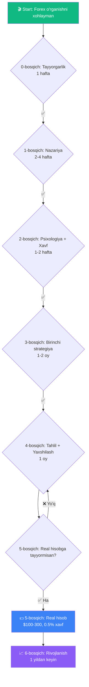
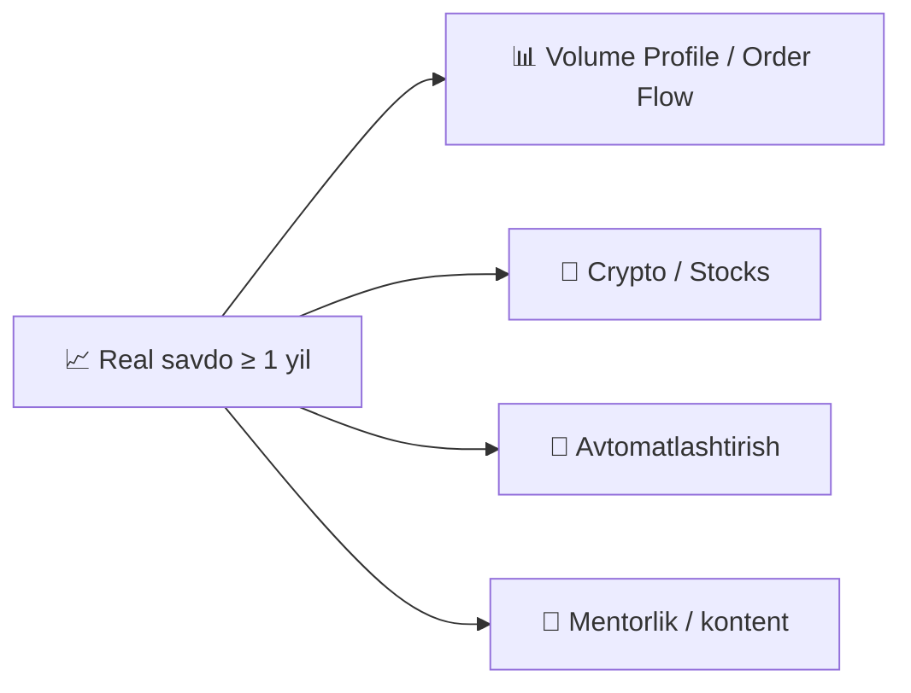

# 🗺️ O'qish yo'l xaritasi

!!! abstract "Ushbu sahifadan qanday foydalanish"
    Bu — forexni endi o'rganishni boshlagan yangi boshlovchi uchun **bosqichma-bosqich yo'l**. Har bir bosqichda:

    - 🎯 **Maqsad** — bosqichdan keyin nima qila olish kerak
    - ⏱️ **Muddat** — real baholash
    - 📚 **Nimani o'qish** — loyihaning aniq sahifalari
    - ✅ **Nazorat nuqtasi** — keyingi bosqichga o'tish mezoni

    Nazorat nuqtalarini yopmaguningizcha **keyingi darajaga o'tmang**. Aks holda pulingizni behuda yo'qotasiz.

## Umumiy ko'rinish

---

## 0-bosqich: Tayyorgarlik

!!! info "Maqsad"
    **Forex nima ekanligini** tushunish va u sizga mosligini tekshirish.

⏱️ **Muddat**: ~1 hafta.

### Harakatlar

| Qadam | Qayerda | Vaqt |
|---|---|---|
| 1. «Loyihadan qanday foydalanish» ni o'qish | [Bosh sahifa](index.md) | 30 daq |
| 2. Tuzilmani tushunish: qo'llanma, asboblar, strategiyalar | [README](https://github.com/MukhammadAmir-Akbarov/forex-toolkit/blob/main/README.md) | 15 daq |
| 3. 30 savolli tayyorgarlik testini topshirish | `tools/risk_profile.py` | 20 daq |
| 4. Python va bog'liqliklarni o'rnatish | Ko'rsatma | 30 daq |

### ✅ Nazorat nuqtasi

- [ ] Men **pip**, **lot**, **spred**, **leverage** nima ekanini bilaman
- [ ] **Forexda 74-89% pul yo'qotishini** tushunaman
- [ ] Tayyorgarlik testi **> 50%** ko'rsatdi
- [ ] **Python o'rnatilgan**, `pytest` o'tadi

---

## 1-bosqich: Nazariya asoslari

!!! info "Maqsad"
    Treyderning **asosiy lug'atini** o'rganish: trendlar, qo'llab-quvvatlash/qarshilik, indikatorlar, sham patternlari.

⏱️ **Muddat**: 2-4 hafta (kuniga 30-60 daqiqa).

### Harakatlar

| Qadam | Qayerda | Vaqt |
|---|---|---|
| 1. **Asosiy qo'llanma** (to'liq) | [forex-guide.md](forex-guide.md) | ~5 soat |
| 2. Texnik tahlil grafiklar bilan | [docs/technical-analysis.md](docs/technical-analysis.md) | ~3 soat |
| 3. Lug'at — notanish atamalarni yozib oling | [extras/glossary.md](extras/glossary.md) | o'qish davomida |
| 4. FAQ — asosiy savollarga javob | [extras/faq.md](extras/faq.md) | 1 soat |
| 5. Tartibga solinadigan brokerda **demo-hisob** ochish | [Brokerlar (UZ)](uz/brokers-uz.md) | 30 daq |
| 6. MT5 / TradingView interfeysini o'zlashtirish | YouTube + amaliyot | 2-3 soat |

### ✅ Nazorat nuqtasi

- [ ] EMA, RSI, trend nima ekanini **boshqasiga tushuntira olaman**
- [ ] Grafikda qo'llab-quvvatlash/qarshilik darajalarini **ko'rsata olaman**
- [ ] $1000+ virtual mablag' bilan **demo-hisobim ochiq**
- [ ] Terminalda savdo **ocha va yopa olaman** (to'g'ri stop va take bilan)
- [ ] Aniq sababsiz **savdo ochmayman**

---

## 2-bosqich: Psixologiya va xavf-menejment

!!! info "Maqsad"
    **Asosiy raqibingiz — o'zingiz** ekanligini tushunish va buni boshqarishni o'rganish.

⏱️ **Muddat**: 1-2 hafta.

### Harakatlar

| Qadam | Qayerda | Vaqt |
|---|---|---|
| 1. **Psixologiya** bo'limi | [extras/psychology.md](extras/psychology.md) | ~2 soat |
| 2. **Anti-Tilt protokol** | [extras/anti-tilt-protocol.md](extras/anti-tilt-protocol.md) | 30 daq |
| 3. Shaxsiy **savdo rejasini** to'ldirish | [extras/trading-plan-template.md](extras/trading-plan-template.md) | 1 soat |
| 4. **Pozitsiya kalkulyatorini** o'zlashtirish | [Kalkulyator](tools/position-calculator.md) | 15 daq |
| 5. **Kunlik tartib** — treyderning kun rejimi | [extras/daily-routine.md](extras/daily-routine.md) | 30 daq |
| 6. **Ma'lumotlar manbalari** — nimani kuzatish | [extras/market-data-sources.md](extras/market-data-sources.md) | 1 soat |

### ✅ Nazorat nuqtasi

- [ ] Trading Plan **to'ldirilgan va chop etilgan**
- [ ] **3 ketma-ket yo'qotishdan keyin** nima qilishni bilaman (anti-tilt)
- [ ] Pozitsiya kalkulyatoridan **foydalana olaman**
- [ ] **Xavfni hisoblamasdan** pozitsiya ochmayman
- [ ] Kunlik tartibimni **yozganman**

---

## 3-bosqich: Birinchi strategiya

!!! info "Maqsad"
    **Bitta strategiyani chuqur** o'zlashtirish, demoda 30+ savdo qilish, **jurnal yuritish**.

⏱️ **Muddat**: 1-2 oy. **Shoshilmang.**

### Harakatlar

| Qadam | Qayerda | Vaqt |
|---|---|---|
| 1. **EMA50 Pullback** strategiyasini batafsil o'rganish | [docs/strategy-details.md](docs/strategy-details.md) | 1 soat |
| 2. Sintetikada **bektesterni** ishga tushirish | `python bot/backtest.py` | 30 daq |
| 3. EUR/USD uchun **real ma'lumotlarni** yuklab olish | `python advanced/data_downloader.py` | 10 daq |
| 4. **Real spred** bilan bektest | `python bot/backtest.py --csv data/EURUSD_1h.csv --spread-pips 2 --max-consecutive-losses 3` | 30 daq |
| 5. **Savdo jurnalini** ochish | `python tools/journal_cli.py --help` | 5 daq |
| 6. EMA50 strategiyasi bo'yicha **demoda 30+ savdo** | Broker terminali | 1-2 oy |
| 7. **Har bir savdo** jurnalda, kirish sababi va his-tuyg'ular bilan | `journal_cli.py add` | 5 daq/savdo |

### ✅ Nazorat nuqtasi

- [ ] Jurnalda kirish tasvirlari bilan **30+ yozuv**
- [ ] `journal_dashboard.py` ni ishga tushirib o'z statistikamni **o'qiy olaman**
- [ ] Demoda win rate va Profit Factor **barqaror**
- [ ] So'nggi 10 ta savdoda Trading Plan ni **buzmadim**

---

## 4-bosqich: Tahlil va yaxshilash

!!! info "Maqsad"
    **O'z xatolarini** topish, nima ishlayotganini tushunish va strategiyani tuzatish.

⏱️ **Muddat**: ~1 oy.

### Harakatlar

| Qadam | Qayerda | Vaqt |
|---|---|---|
| 1. **Jurnal analizatori** — AI insaytlar | `python tools/journal_analyzer.py` | 30 daq |
| 2. **Xatolar jurnali** — takrorlanadiganlarini yozish | [journal/mistakes-log.md](journal/mistakes-log.md) | 1 soat |
| 3. **Strategiyalar taqqoslash** | `python strategies/compare.py` | 1 soat |
| 4. **Walk-forward optimizatsiya** | `python advanced/walk_forward.py` | 30 daq |
| 5. **Monte Carlo** — vayron bo'lish xavfi | `python tools/monte_carlo.py` | 15 daq |
| 6. Tuzatishlar bilan **yana 30 demo savdo** | Terminal | 1 oy |

### ✅ Nazorat nuqtasi

- [ ] **3 ta asosiy xatomni** bilaman va yozganman
- [ ] Yangi savdolarda kamida bittasini **tuzatdim**
- [ ] Win rate **barqaror** (80% → 20% → 70% sakrash yo'q)
- [ ] Demoda **3 oydan ortiq** o'tdi
- [ ] Real yo'qotishlarga **psixologik tayyorman**

---

## 5-bosqich: Real hisobga o'tish

!!! info "Maqsad"
    **Minimal depozit** bilan real pulga o'tish, xavf qoidalarini buzmasdan.

⏱️ **Muddat**: individual.

### Harakatlar

| Qadam | Qayerda | Vaqt |
|---|---|---|
| 1. **Demo vs Real** ni o'qish | [journal/demo-vs-real-comparison.md](journal/demo-vs-real-comparison.md) | 30 daq |
| 2. $100-300 ga **real hisob** ochish | Demo bilan bir xil brokerda | 1-2 kun (KYC) |
| 3. Faqat **mikro-lot** (0.01) | Terminal | — |
| 4. Savdoga **0.5% xavf** — istisnosiz | Pozitsiya kalkulyatori | har savdo |
| 5. **Birinchi real savdo** alohida yoziladi | `journal_cli.py add` | — |
| 6. Jurnal bilan **30 real savdo** | 1-2 oy | 5 daq/savdo |

!!! danger "Real pulning asosiy qoidasi"
    **Yashashga, ijaraga, ovqatga kerakli pul bilan savdo qilmang.**

    Real yo'qotishlar demodagidan **kuchliroq ta'sir qiladi**. Bu normal. Buni qabul qiling.

### ✅ Nazorat nuqtasi

- [ ] Jurnalda **30+ real savdo**
- [ ] Hech bir savdoda **0.5% xavfdan oshmadim**
- [ ] Balans **15% dan ortiq tushmadi**
- [ ] His-tuyg'usiz qarorlar bilan **prosadkani chiday olaman**

---

## 6-bosqich: Rivojlanish (1 yildan keyin)

!!! info "Maqsad"
    Chuqurroq o'rganish, asboblarni kengaytirish, ehtimol avtomatlashtirish.

⏱️ **Muddat**: cheksiz.

### Mumkin bo'lgan yo'nalishlar

### Bu bosqichda NIMA QILMASLIK kerak

- ❌ Xavfni keskin **5-10% gacha oshirish**
- ❌ **Pulli signallarga** obuna bo'lish
- ❌ Jurnalni tashlab qo'yish — u **yanada muhimroq** bo'ladi
- ❌ Boshqalarga o'rgatish, **o'zingiz 2+ yil barqaror** daromad ko'rsatmaguningizcha

---

## ⚠️ Asosiy qoidalar (har bosqichda)

!!! warning "O'tkazib yubormang"
    1. **Kerakli pul bilan savdo qilmang**
    2. Reaga o'tishdan oldin **kamida 3 oy demo**
    3. **Doim stop-loss qo'ying**
    4. Savdoga **xavf ≤ 1%** (yangi boshlovchi 0.5%)
    5. Har savdoda **jurnal yuriting**
    6. Oson pul va'dalariga **ishonmang**
    7. Faqat g'alabalarni emas, **yo'qotishlarni ham tahlil qiling**
    8. «Gurular» dan **uzoq turing** — pulli signallar yo'q

## 📍 Hozir qaerdasiz?

| Hozir sizda... | Bu yerga boring |
|---|---|
| 0 bilim | [0-bosqich: Tayyorgarlik](#0-bosqich-tayyorgarlik) |
| Demo bor, indikatorlar tushunarsiz | [1-bosqich: Nazariya](#1-bosqich-nazariya-asoslari) |
| Nazariya bor, demoda yo'qotyapsiz | [2-bosqich: Psixologiya](#2-bosqich-psixologiya-va-xavf-menejment) |
| Jurnalsiz 10+ demo savdo | [3-bosqich: Birinchi strategiya](#3-bosqich-birinchi-strategiya) |
| 30+ savdo, win rate beqaror | [4-bosqich: Tahlil](#4-bosqich-tahlil-va-yaxshilash) |
| Demoda 3+ oy barqaror | [5-bosqich: Real](#5-bosqich-real-hisobga-otish) |
| Realda 1+ yil | [6-bosqich: Rivojlanish](#6-bosqich-rivojlanish-1-yildan-keyin) |

---

## ⚠️ Mas'uliyatdan ozod qilish

Bu — **o'quv** marshrut. Muddatlar — taxminiy. Har kim o'z tezligida o'rganadi. Tayyor emasligingizni his qilsangiz — **shoshilmang**. Depozit yo'qotgandan ko'ra qo'shimcha bir oy demo'da qolish yaxshi.

**Hech qanday «yo'l xaritasi» foydani kafolatlamaydi.** Yakuniy natija faqat sizga bog'liq — intizom, xavf-menejment va psixologiya.
